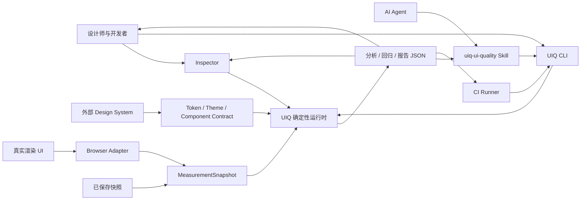
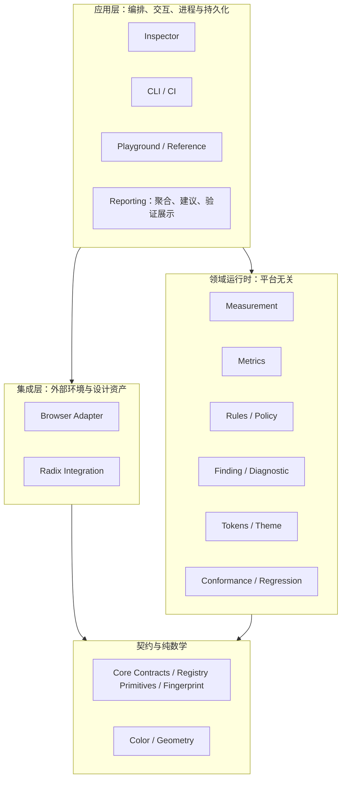
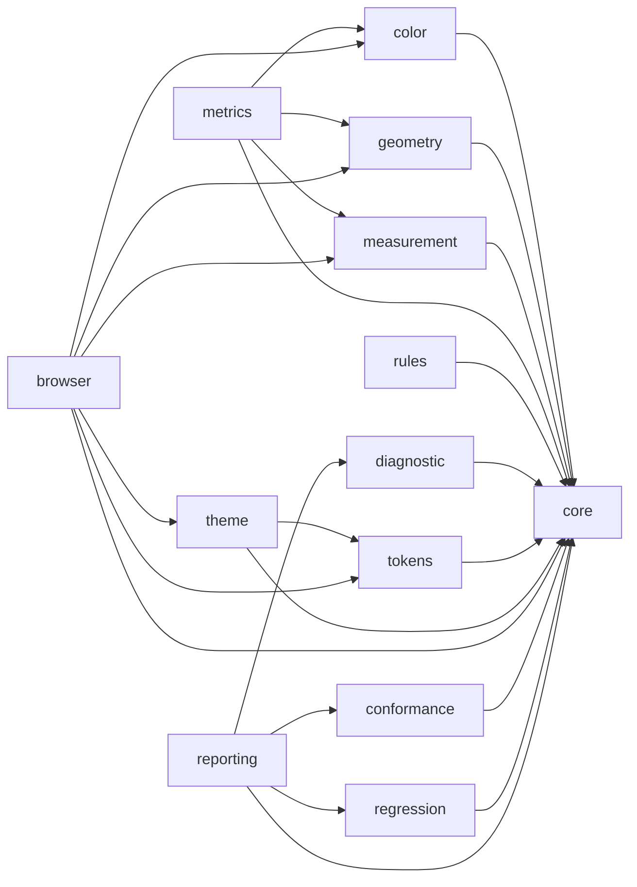
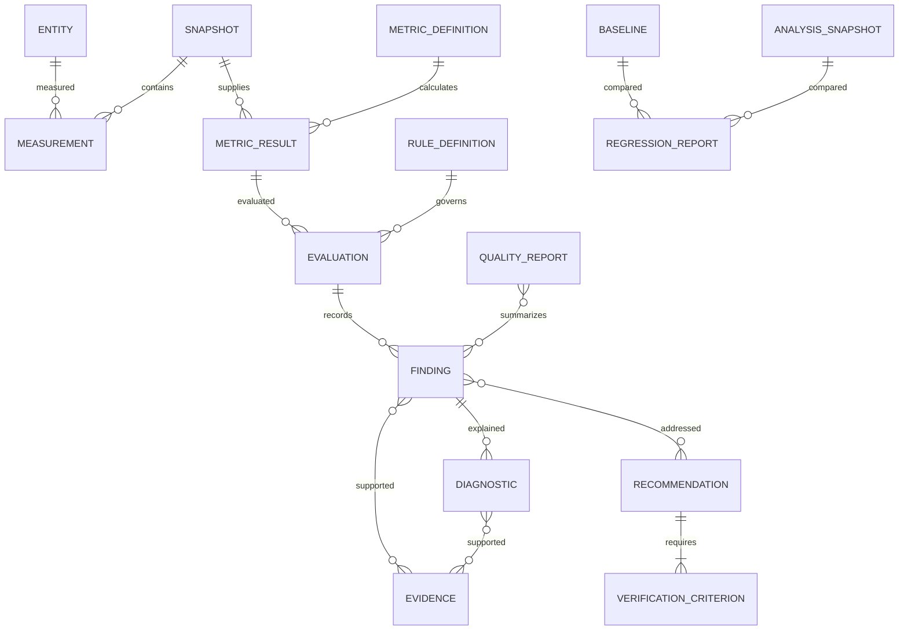
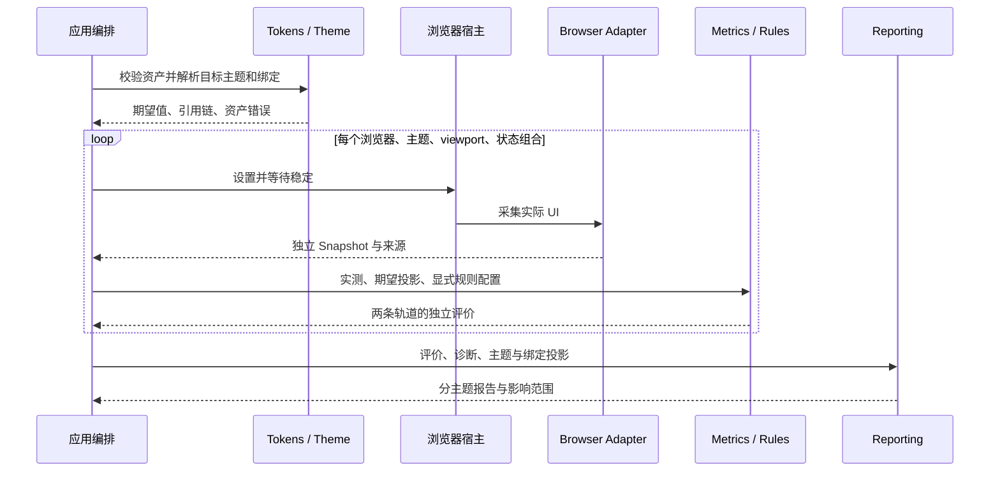
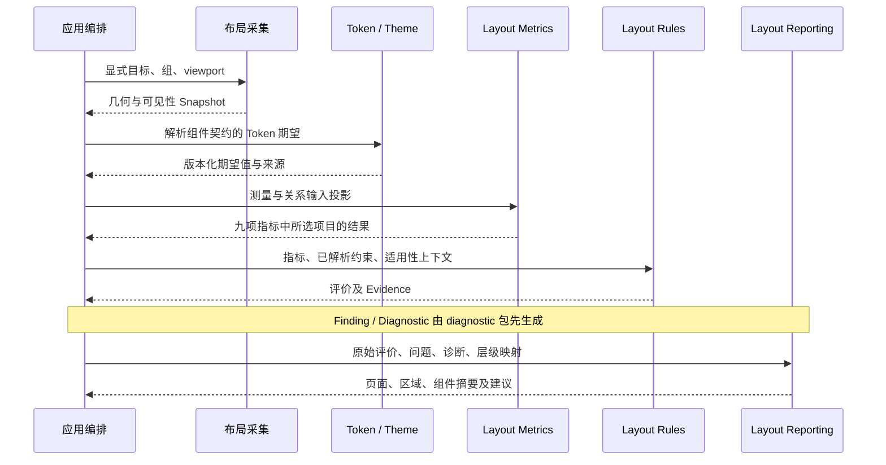
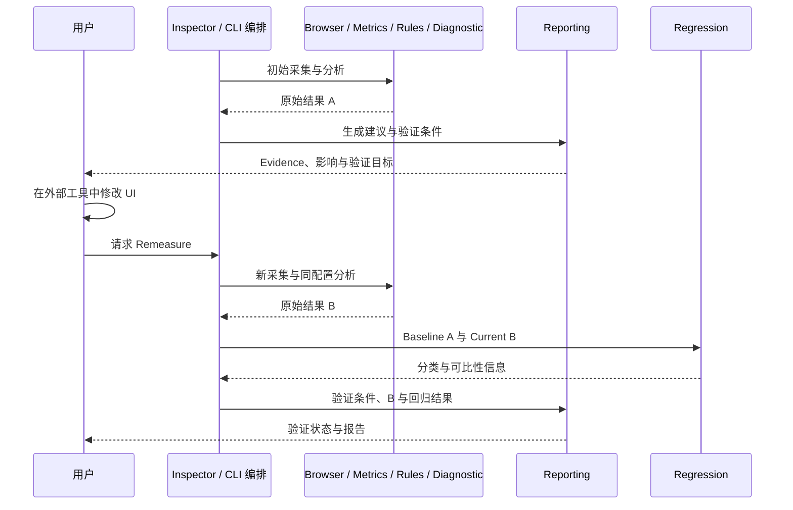
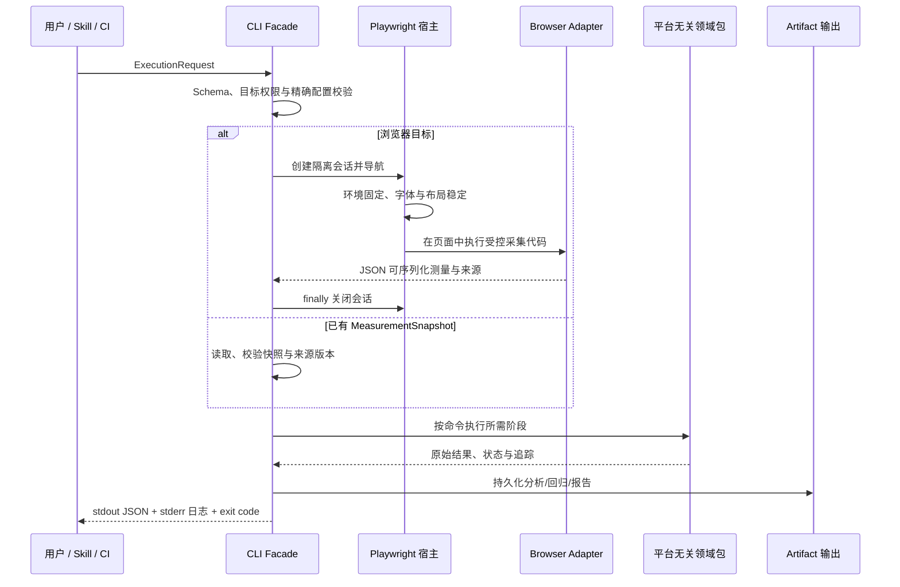
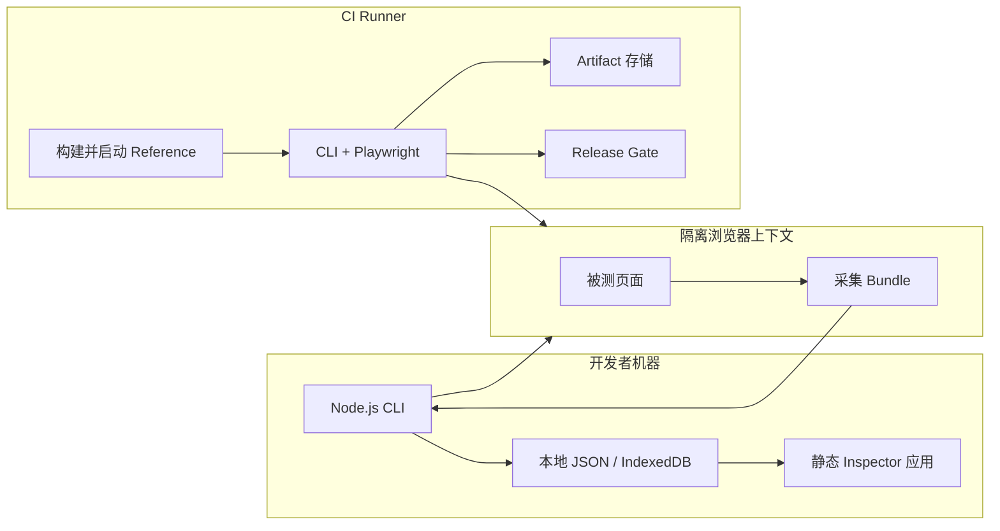

# UIQ-ARCH-01 V1.0 完整工程架构设计

| 项目 | 内容 |
|---|---|
| 文档版本 | 1.0.0 |
| 文档性质 | 实现架构设计；不是新增产品规范，也不是实现完成声明 |
| 依据范围 | 当前 `specs/` 目录内的 43 份规范，完整索引见附录 A |
| 目标读者 | 架构、运行时、前端、设计系统、测试与工具集成开发者 |
| 交付范围 | 总体架构、模块契约、运行流程、应用集成、工程与验收设计 |
| 当前工程事实 | 本次检查未发现 `package.json`；下述包、接口和测试位置均为目标设计 |
| 变更边界 | 保留原规范；不生成业务实现，不搭建后端，不生成 Skill 安装包 |

## 1. 设计目标与范围

UIQ 是 UI Design Quality Engineering System：把真实 UI 转换为可复现的事实、指标、规则评价、问题、解释与验证证据。它不是审美打分器、设计编辑器或自动设计生成器。

完整业务闭环为：

`实际 UI → Measurement → Metric → Rule Evaluation → Finding → Diagnostic → Recommendation → 人工修改 → Remeasure → Verification / Regression → Release Gate → Report`。

### 1.1 架构目标

1. 同一有效输入、算法版本和配置产生等价结果，支持离线重放。
2. 核心计算不依赖 DOM、React、Radix UI、Node.js 文件系统或网络。
3. 每个问题可追溯到目标、实际值、期望值、规则版本、测量和来源。
4. 浏览器采集、确定性计算、发布决策和人机解释分离。
5. 新能力落入已有 Metric、Rule、Registry、Adapter、Diagnostic、Reporting 扩展点。
6. Inspector、CLI、CI 与 Skill 使用同一套领域包，不各自实现数学或评价算法。

### 1.2 能力范围

| 分类 | V1.0 设计范围 | 明确边界 |
|---|---|---|
| 输入 | 真实浏览器 DOM、已保存测量快照、Token/Theme/组件契约 | HTML 文件需要浏览器渲染；静态源代码不能冒充实际布局 |
| 计算 | 颜色、几何、排版、间距、布局及明确的层级关系 | 模型、算法或关系不足时保留 UNKNOWN，不补造数值 |
| 验证 | 规则评价、设计系统一致性、技术 Conformance、回归 | 这四类结论分开存储，不相互替代 |
| 交互 | Inspector、Playground、Reference App | Inspector 只分析，不编辑设计资产 |
| 自动化 | CLI 八类命令、CI 产物、统一 Skill 入口 | Skill 调用 CLI，不实现第二套评价引擎 |
| 延后或非目标 | Figma/截图精确采集、企业治理服务、多用户历史平台 | 保留 Adapter/应用集成位置，不作为 V1.0 必需依赖 |
| 禁止 | 统一美学分数、未经授权自动修改 UI、隐藏阈值 | 单个已定义指标的比例不等于整体质量分数 |

“完整 V1.0”不表示所有概念性指标都已具有可执行算法。APCA、特定 ΔE 方法和尚未定义完整输入的层级能力必须声明支持状态；不能以返回常数的方式宣称支持。

## 2. 规范依据与设计裁决方法

### 2.1 依据分工

| 规范组 | 在本设计中的作用 |
|---|---|
| 总规范 | 产品目标、Measurement First、Metric ≠ Score、可解释性和非目标 |
| REF-01/02 | Browser-first、平台无关内核、适配与应用边界、工程技术方向 |
| IMPL-19 | 13 个领域/运行时包、4 个应用、Radix Integration 和严格依赖白名单 |
| IMPL-03/04/05/06/08 等专项 | 契约、算法和执行语义；与 IMPL-16 重复定义处显式对照 |
| ER、DG、DX、TK、MR、METRIC | 领域语义、规则政策、证据和指标注册依据 |
| REPORT、IMPL-17/18 | 报告聚合、建议生成、验证条件和 Inspector 集成 |
| LAYOUT-01～08 | 布局专项输入、算法、约束、聚合、Golden 和实现落点 |
| SKILL-01～04 | Agent 工作流、CLI 请求/响应、Playwright 执行及安全边界 |
| TST、IMPL-11/14/15 | 测试体系、回归、验收场景与里程碑 |

不按文档编号大小推断全局覆盖关系。明确的禁止条款优先于示意依赖图；领域语义与实现示例不一致时，记录裁决并补充针对性契约测试。

### 2.2 设计标记与缺失依据

- **规范约束**：可在附录 A 的来源中定位的既有要求。
- **设计决策 AD-xx**：为实现闭环补足的工程选择或冲突裁决，集中记录于附录 B；不是宣称原规范已有完全相同的定义。
- **实现风险**：源规范示例不完备、字段不一致或尚缺测试依据的事项，见第 18 节。

当前目录没有被多份文档引用的 `UIQ-FM-01`。总规范“下一阶段”列举的 CM/LM/TM/SM/HM/CR 等文件也不能仅凭名称当作已存在依据。基础契约暂以 IMPL-03 为主，并结合专项规范按 AD-02 归一；补齐正式测量规范后必须重新核对，不能宣称已通过缺失规范的 Conformance。

## 3. 系统上下文与分层

### 3.1 系统上下文

下图箭头表示交互或数据流，不表示 npm 依赖。



### 3.2 逻辑分层



分层图只表达职责。Reporting 在逻辑上属于应用/报告层，但物理上是可复用、无 UI 框架依赖的 `@uiq/reporting` 包。运行顺序不能转译为 `rules → metrics → browser` 的 import 链。

### 3.3 运行位置

| 环境 | 负责内容 | 不允许混入的能力 |
|---|---|---|
| 被测浏览器页面 | DOM/CSSOM 读取、几何采集、来源记录 | 发布政策、文件写入、Agent 推理 |
| Inspector 浏览器 | 应用编排、各领域包执行、证据展示、用户导出 | Node.js/Playwright、自动修复 |
| CLI Node.js 进程 | 参数/配置、Playwright 生命周期、快照重放、计算编排、文件输出 | 将 Playwright 句柄传入领域契约 |
| CI Runner | 安装构建、启动 Reference/被测应用、运行 CLI、存档和门禁 | 自动批准基线或自动把 Actual 写成 Golden |
| Skill/Agent | 意图、目标范围、调用 CLI、解释已产生证据 | 新增指标算法、改写评价结果、隐式读取凭据 |

## 4. 包结构与依赖设计

### 4.1 13 个包的职责与公共能力

表内名称为公共能力摘要；已有接口名保持原名，新增实现名由能力表达，不把此表视作已存在的代码清单。

| 包 | 输入 → 输出 / 公共能力 | 禁止职责 |
|---|---|---|
| `@uiq/core` | 实体、测量、指标、规则、评价、Finding、Evidence、Diagnostic 契约；Registry 基元、指纹 | 颜色算法、Token 解析、平台 I/O、应用总编排 |
| `@uiq/color` | 颜色解析、sRGB/Linear RGB/XYZ D65/OKLab/OKLCH、亮度、对比度、差值、色域 | DOM、规则阈值、配色生成 |
| `@uiq/geometry` | 矩形、面积、距离、交并集、坐标投影等纯函数 | 读取布局、判断是否违反规则 |
| `@uiq/measurement` | Collector/Normalizer/Validator/SnapshotBuilder；结构化事实、单位和快照归一 | 实际 DOM 访问、质量判断 |
| `@uiq/metrics` | MetricRegistry、依赖计划、MetricEngine、各领域指标 → MetricResult | Rule、Finding、Recommendation |
| `@uiq/rules` | RuleRegistry、EvaluationEngine、比较/区间/容差、Policy/Release Gate | 重新测量、重新计算指标 |
| `@uiq/diagnostic` | Finding 工厂、证据解析、原因分类、追踪、影响证据 → Diagnostic | 改写评价、推荐具体设计值、重复计算 |
| `@uiq/tokens` | Token 图、引用解析、绑定事实、图验证、来源与影响追踪 | DOM、框架依赖、直接调用 Color/Rule Engine |
| `@uiq/theme` | Theme 上下文、覆盖解析、主题资产验证、主题比较与影响输入 | 浏览器主题切换、重新实现规则 |
| `@uiq/browser` | BrowserMeasurementAdapter、实体映射、颜色/排版/几何/间距/布局采集 | 执行 Metrics/Rules、调用 Playwright 启动浏览器 |
| `@uiq/conformance` | Schema/Contract/Golden 的测试契约与纯比较、ConformanceReport | 自行启动浏览器、硬编码依赖被测实现 |
| `@uiq/regression` | Baseline + Current → 身份匹配、差异分类、RegressionReport | 重跑 Rule、读取 DOM、自动更新基线 |
| `@uiq/reporting` | QualityReportGenerator、建议 Registry、Impact/Verification、JSON/Markdown/HTML 渲染 | DOM、React、重新执行指标/规则/诊断 |

Registry 通用容器基元可在 core；领域注册、依赖规划和内置实现仍在对应包，不能把 `DefaultMetricRegistry` 示例扩大为全局引擎。

### 4.2 严格依赖白名单

以下是**允许的生产代码直接依赖上限**，不是要求导入所有列出的包；类型依赖同样受限。依据 IMPL-19 §3～4，冲突处理见 AD-01。

| 消费包 | 允许依赖的 UIQ 包 |
|---|---|
| core | 无 |
| color | core |
| geometry | core |
| measurement | core |
| metrics | core、color、geometry、measurement |
| rules | core |
| diagnostic | core |
| tokens | core |
| theme | core、tokens |
| browser | core、measurement、color、geometry、tokens、theme |
| conformance | core |
| regression | core |
| reporting | core、diagnostic、conformance、regression |



本图 `A → B` 唯一表示 A import B。没有 `metrics → rules`、`rules → browser`、`regression → rules` 或 `reporting → browser`。

### 4.3 适配与应用依赖

| 单元 | 允许消费 | 设计约束 |
|---|---|---|
| `integrations/radix` | core、tokens、theme、browser；React/Radix 作为集成依赖 | 组件标识、状态与绑定映射，不承担评价计算 |
| `apps/inspector` | 所需领域包和 Radix Integration | Browser I/O 和 UI 状态留在应用，计算通过包公共 API |
| `apps/cli` | 所需领域包、Node.js、Playwright | Playwright 只在 CLI 的 BrowserExecutor 适配实现和测试工具中 |
| `apps/playground` | 所需领域包和集成 | 调试指标/规则及展示，不成为库依赖 |
| `apps/reference` | React/Radix、CSS Variables；按需集成 Inspector | 提供可控渲染样本，不实现另一套质量算法 |
| `skills/uiq-ui-quality` | CLI 进程契约与文档 | 不作为 UIQ Runtime 的 npm 依赖 |

**AD-03：应用编排不新增 `@uiq/runtime` 包。** CLI 与 Inspector 各保留薄的应用 Facade，分别适配进程和 UI；共享领域实现及相同输入/输出契约，通过双入口等价测试防止语义漂移。允许不同的 I/O 生命周期，不允许复制数学、规则、诊断和回归算法。

### 4.4 跨包契约与注入

- 业务包仅从其他包的 `src/index.ts` 对应公共 exports 引用，不跨入内部源目录。
- tokens/theme 提供解析结果；应用把它们投影为显式输入与配置，交给 metrics/rules。不能为了方便增加 `rules → tokens`。
- diagnostic 接收 Evidence 和结构化依赖边，不从 browser/tokens 包主动抓取来源。
- reporting 的绑定/主题信息是只读报告投影 DTO，由调用方构造；它不 import tokens/theme。
- conformance 的 Golden 执行器通过调用方传入的函数契约运行被测实现；纯比较与实际浏览器启动解耦。测试 harness 可依赖多个包，不能把测试依赖带入生产入口。
- Release Gate 在 rules 中只接收 core 评价和结构化政策事实 DTO；应用投影 Conformance/Regression 结果，不让 rules 反向依赖这两个包。

## 5. 核心数据架构

### 5.1 数据所有权

| 数据 | 契约归属 | 关键字段或关系 | 生命周期 |
|---|---|---|---|
| UIQEntity | core | `id`、`type` | Scope 内唯一；不装入 DOM、名称和 CSS selector |
| Measurement | core | `id`、`subjectId`、`type`、`value`、`unit`、`source`、`status`、`timestamp` | 采集后只读 |
| MeasurementSnapshot | core；measurement 构造 | `id`、`capturedAt`、`source`、`environment`、`measurements` | 不可变采集快照 |
| MetricDefinition / MetricDependency | core；metrics 实现 | 精确 ID/版本、kind、依赖声明、calculate | Registry 注册后在执行会话中固定 |
| MetricResult | core | 指标/目标身份、可选 value、三态、dependencies、fingerprint | 单次输入计算事实 |
| RuleDefinition / RuleConfiguration | core；rules 实现 | 绑定指标版本、适用性、比较/区间、阈值、配置 | 定义与运行配置分离 |
| EvaluationResult | core | rule 身份、subject、state、severity、metricResult、evidence、fingerprint | 原始评价不可变 |
| Finding / Evidence / Diagnostic | core；diagnostic 构造 | Finding 引用评价；Diagnostic 引用 Finding；Evidence 定向引用来源 | 保留原始记录；生命周期单独推进 |
| Token / Binding | tokens | 引用图、解析链、来源与绑定可信度 | 按资产版本与上下文隔离 |
| Theme | theme | themeId、Token 覆盖、状态与组件上下文 | 每个主题独立解析 |
| Layout 输入投影 | measurement/metrics/rules 各自边界 DTO | 元素矩形、分组、关系、约束与来源 | 显式投影，不反向引用上游包实现 |
| AnalysisSnapshot / Baseline | regression 的交换契约，应用组装 | snapshot、metrics、evaluations、findings、engine、theme | Baseline 由用户批准后固定 |
| QualityReportInput / UIQualityReport | reporting | 原始结果引用、摘要、维度、建议、复现信息 | 只读结果派生物 |
| ImprovementRecommendation / VerificationCriterion | reporting | 目标、理由、Evidence、影响、验证目标 | 建议不是修复完成记录 |
| UIQExecutionRequest / UIQCLIResponse | CLI 应用边界 | command、target/scope、config、status、data/errors、复现信息 | 单次自动化调用 |

### 5.2 主对象关系



图表示逻辑关联，不要求数据库或 ORM。Page/Region/Component/Element 的成员关系由应用/适配元数据保存，不向 core 实体加入 UI 专属字段。

### 5.3 关键接口摘要

下列为依据 IMPL-03、07、17 和 SKILL-04 摘录的接口边界，省略领域对象内部字段；并非新增完整类型声明或可独立编译的文件。

```ts
interface BrowserMeasurementAdapter {
  measure(element: Element, context?: BrowserMeasurementContext): MeasurementSnapshot;
}
interface MetricDefinition<T = unknown> {
  readonly id: string;
  readonly version: string;
  readonly dependencies: readonly MetricDependency[];
  calculate(context: MetricCalculationContext): MetricResult<T>;
}
interface QualityReportGenerator {
  generate(input: QualityReportInput): UIQualityReport;
}
interface UIQCLIResponse<T> {
  readonly schemaVersion: string;
  readonly uiqVersion: string;
  readonly cliVersion: string;
  readonly command: string;
  readonly status: "COMPLETED" | "PARTIAL" | "UNKNOWN" | "ERROR";
  readonly data?: T;
  readonly errors?: readonly CLIError[];
  readonly warnings?: readonly CLIWarning[];
  readonly reproducibility?: ReproducibilityMetadata;
}
```

规则引擎消费 `EvaluationRequest` 中的 snapshot 身份、目标、精确规则引用、已完成指标和配置。适用性需要的快照/组件上下文由应用按 core 契约注入，不能在 rules 内根据 snapshotId 读取全局存储。

### 5.4 归一化契约与序列化

**AD-02、AD-04：** core 公共结构以 IMPL-03 为主：

- Measurement/Snapshot/Finding 的核心时间统一为 epoch 毫秒；报告的 `generatedAt` 为 ISO 8601 UTC 字符串。转换只在边界进行。
- `MetricDefinition.dependencies` 和 `MetricResult.dependencies` 均保存 core 的依赖声明。实际依赖结果的身份、状态与指纹保存在 `metadata` 的版本化 execution trace 投影，完整结果在分析产物中可解析；不在 result.dependencies 混装递归结果。
- UNKNOWN/ERROR 测量以 `Measurement<T | null>` 的 `value: null` 表达缺值，AVAILABLE 禁止 null；MetricResult UNKNOWN/ERROR 不伪造 value。此条件由 Schema/Contract 强化，不能仅依赖 `unknown` 类型。
- `Map`、函数、Element、ElementHandle 不跨 JSON 边界。Registry 导出的是可序列化 Definition Descriptor；执行函数由本地已注册且版本匹配的实现提供。
- Schema 覆盖 Measurement、Snapshot、Definition Descriptor、MetricResult、RuleConfiguration、Evaluation、Finding、Diagnostic、Token/Theme、布局约束、Recommendation、Report、Baseline、Regression、CLI Request/Response。
- **AD-05：Schema 采用 JSON Schema 2020-12。** Schema 放在契约所属包，不新建 schema 核心包；core 不引入校验器运行时。CLI/测试宿主使用 Ajv 8，浏览器构建使用预编译验证函数；TS/Schema 等价由契约测试保证。
- 对未知 schemaVersion、非有限数值或非法数值范围、断裂引用、同 Scope 重复 ID、枚举错误和版本错配显式报错。metadata 不作为绕过校验的无限数据通道。
- 不自动猜测旧数据属于哪个规范版本。导入需要显式来源 dialect，已知映射经过验证后生成新产物并保留原件，未知映射拒绝。

### 5.5 三类产物不能混用

| 产物 | 内容 | 可执行操作 |
|---|---|---|
| 测量快照 | 测量、采集环境、来源；不含完整评价 | analyze/evaluate 离线执行 |
| 分析产物 | 快照、指标、评价、Finding、Diagnostic、配置/版本、绑定投影 | report、保存 Baseline、regression、证据查询 |
| 展示报告 | 统计、分组、建议、验证摘要和原始证据引用 | JSON/Markdown/HTML 展示；不能替代缺失原始证据 |

`uiq report snapshot.json` 中的文件名不决定内容类型。**AD-06：report 只接受完整分析产物或已生成的报告；只有 MeasurementSnapshot 时返回 INPUT_ERROR，并提示先 analyze。** 不因文件扩展名相同隐式重跑分析。

## 6. 身份、版本、确定性与缓存

### 6.1 身份策略

- 目标优先 `data-uiq-id`；其次经过唯一性验证的稳定 DOM 身份；运行期生成 ID 仅可用于本次采集，不保证跨快照匹配。
- 区分元素实例 ID 与组件类型/版本；不能把所有 Button 实例合并成一个 subjectId。
- Snapshot 内容身份包含目标 Scope、测量事实、环境、主题/状态与采集配置；采集时间单独记录，不仅用时间戳或 URL 作为身份。
- 指标/规则/建议规则/组件契约/布局约束都使用精确 ID 与版本，禁止 `latest` 或自动升级到“兼容”版本。
- 同一 Metric 在多个关系/分组上执行时，应用创建稳定的关系目标 ID，并记录成员实体；避免同一 subjectId/metricId/version 下出现多条无法区分的结果。

### 6.2 内容指纹与逻辑问题身份

**AD-07：** 区分内容变化与问题关联：

| 身份 | 包含内容 | 用途 |
|---|---|---|
| Snapshot 内容哈希 | 稳定测量/环境/Scope/采集配置 | 输入身份、重放 |
| Metric 指纹 | Snapshot 内容、目标、指标版本、算法配置、依赖结果身份 | 结果缓存与追踪 |
| Evaluation 指纹 | Metric 指纹、规则版本、适用性输入、有效配置、状态 | 评价内容身份 |
| Finding fingerprint | IMPL-08 的目标、规则/指标版本、相关评价状态与 Evidence | 相同事实下的问题识别 |
| 回归匹配键 | 目标、规则/指标版本、约束 ID/版本、主题/状态/Scope | 数值改变后的逻辑问题关联；不使用 message/数组序号 |
| Group ID | 类型、规则/约束版本、原因、上下文；不含单个 subjectId | 合并展示，保留成员 Finding IDs |

DG-01 的含 snapshot 指纹和 IMPL-08 的含 Evidence 指纹不能单独完成跨采集逻辑匹配。regression 先校验可比上下文，再按匹配键关联，fingerprint 用于内容变化判断，不能因为证据变了就把持续问题判为新问题。

### 6.3 Canonical JSON 与时间

**AD-08：** Canonical JSON 使用固定键排序、UTF-8、有限数值、保留有序数组顺序；仅对声明为集合的数据按稳定键排序。禁止对布局顺序、透明背景链进行通用排序。哈希选 SHA-256，使用平台无关实现；core 不 import `node:crypto`，不得把异步 Web Crypto 隐式塞进同步指标接口。

采集与应用提供时间；核心数学不调用 `Date.now()` 或 `Math.random()`。报告默认从输入采集时间生成稳定 `generatedAt`；显式传入生成时间时把它视为输入。日志耗时和进程运行 ID 不参与语义指纹。

重测产生新的采集记录，若渲染内容完全相同，内容哈希允许相同。验证必须证明进行了修改后的重新采集，不能仅凭缓存命中或 snapshotId 字符串不同宣称完成。

### 6.4 缓存与增量

| 缓存 | 完整逻辑键 | 失效条件 |
|---|---|---|
| Token 解析 | 资产版本、tokenId、theme/state、覆盖配置哈希 | 引用或覆盖变化 |
| Metric | snapshotId、subjectId、metricId/version、算法配置哈希 | 测量、分组、关系、算法版本或配置变化 |
| Evaluation | Metric 指纹、ruleId/version、规则配置与适用性上下文哈希 | 阈值、规则、主题/状态、组件适用性变化 |
| 报告 | 输入结果指纹、报告/建议规则版本、Scope、呈现配置 | 原始结果、语言模板、建议配置变化 |

IMPL-05 的四字段缓存键是最小形式；配置和关系不在 snapshot 中时，必须补充入有效键（AD-08）。V1.0 默认会话级缓存，不跨 Snapshot 直接复用指标。Token 影响图用于选择需要重测的目标；选中的目标仍生成新事实和新执行上下文。未来跨快照复用需要证明完整输入等价，不能仅靠 URL 相同。

## 7. 状态、异常与政策

### 7.1 独立状态空间

| 对象 | 合法状态 | 含义 |
|---|---|---|
| Measurement / MetricResult | AVAILABLE、UNKNOWN、ERROR | 可用事实、证据不足、执行/输入错误 |
| Applicability | APPLICABLE、NOT_APPLICABLE、UNKNOWN | 是否能够应用规则 |
| EvaluationResult | PASS、FAIL、WARN、NOT_APPLICABLE、UNKNOWN、ERROR | 规则评价结果 |
| Severity | INFO、LOW、MEDIUM、HIGH、CRITICAL | 影响等级，和评价状态正交 |
| Finding 生命周期 | DETECTED、DIAGNOSED、RESOLVED、VERIFIED | 问题处理进程，评价保存在 `finding.evaluation.state` |
| Diagnostic confidence | DIRECT、SUPPORTED、INFERRED、UNKNOWN | 原因证据可信程度，不是正确率分数 |
| Verification 展示 | NOT_VERIFIED、PASS、FAIL、UNKNOWN、ERROR | 对已有验证条件的结果投影 |
| Release Gate | ALLOW、WARN、BLOCK | 政策决定，不改写评价 |
| CLI response.status | COMPLETED、PARTIAL、UNKNOWN、ERROR | 进程工作完成度，不表示 UI 通过 |

`ACKNOWLEDGED` 只作为应用人工确认元数据；不是新增 core 生命周期值。Token 的 MATCH/NO_MATCH/ORPHAN 等领域值也不是 EvaluationState。

### 7.2 传播与短路

| 条件 | 输出行为 |
|---|---|
| 请求格式错误、指定版本不存在、必需配置非法 | 输入/配置错误；停止受影响请求或执行分支，保留错误阶段 |
| 适用性明确为 NOT_APPLICABLE | 不执行条件比较，评价 NOT_APPLICABLE；不计入 PASS |
| 适用性 UNKNOWN | 评价 UNKNOWN，不猜测文字语义、组件关系或阈值 |
| 适用且必需 Metric UNKNOWN | 评价 UNKNOWN，不比较，不产生普通失败结论 |
| 适用且 Metric ERROR | 评价 ERROR，建立执行错误 Evidence |
| Metric AVAILABLE 且条件满足 | PASS；标准规则不得因低 Severity 放宽条件 |
| Metric AVAILABLE 且条件不满足 | FAIL；仅显式定义的 advisory outcome 可产生 WARN |
| FAIL / WARN | 默认生成 Finding，保留原 Evaluation |
| UNKNOWN | 默认保留评价；Policy 可生成 UNKNOWN_CAUSE 信息 Finding |
| ERROR | 保留错误；可生成 EXECUTION_ERROR Finding，不能报告为设计质量 FAIL |

**AD-09：** 请求/配置校验优先；适用性检查先于数值条件比较。局部失败不吞掉其他有效目标结果；输出 PARTIAL 并保留覆盖率和错误列表。无可靠输入时终止后续“质量结论”，但允许输出执行诊断。

### 7.3 阈值、容差与发布政策

- Threshold 是规则要求；浮点 epsilon、测试 tolerance、业务允许偏差是三个不同参数。
- 核心对比度示例使用 `>= 4.5`，不先四舍五入；约 4.48 不能因为显示成一位小数而 PASS。
- **AD-10：** 布局规范里的“允许 1px 对齐偏差”归一为 Rule 的显式业务上限；额外数值容差独立配置，不能两次放宽。相对容差的基准为零时，仅允许显式绝对容差，否则配置错误。
- PolicyProfile 组织规则和配置，Release Gate 消费已存在评价、Conformance 与 Regression 的政策事实。
- 示例政策可以是 `onFail=WARN`、`onError=BLOCK`、`onUnknown=WARN`；这只是项目配置，不是强制质量标准。
- 无法加载有效 Policy 时返回配置错误，不能默认 ALLOW。

## 8. Measurement 与 Browser Adapter

### 8.1 采集流水线

`目标与范围校验 → 环境固定 → DOM/字体就绪 → 布局稳定 → 实体发现 → 批量读取样式/矩形 → 单位归一 → 来源记录 → Snapshot 校验与冻结`。

- 浏览器 `getComputedStyle()` / `getBoundingClientRect()` 是首要事实来源；声明 CSS 和 Token 只提供意图/来源证据。
- 坐标默认 viewport 坐标系，单位 CSS px；DPR 不用于把 40 CSS px 转为 80 布局 px。记录 scroll、zoom、viewport、DPR、浏览器版本、主题、locale 和交互状态。
- **AD-11：** core environment 保留已定义字段，补充环境字段存入应用采集上下文及受控 measurement metadata，参与快照内容身份；不借此扩大 core 到浏览器会话模型。
- DOM 读操作分批进行，避免测量过程中写样式造成布局抖动。同一快照内不混入不同主题、viewport 或采集轮次。
- 字体、导航、布局稳定均有宿主配置的有限超时。`networkidle` 沿用 SKILL-04 默认，但不是页面稳定的充分条件；超时不能静默当成功。

### 8.2 测量能力与降级

| 场景 | 处理 |
|---|---|
| 不透明纯色 | 保留原始字符串、解析值和来源 |
| 透明背景/前景 | 记录逐层背景链和 alpha，调用 color 的线性合成函数，不默认白底 |
| 渐变、图片、视频、复杂混合/滤镜 | 相关颜色关系 UNKNOWN；几何等其他可用测量保留 |
| `line-height: normal` | 无法可靠解析为长度时 UNKNOWN，不把字符串当数字 |
| 隐藏/零面积元素 | 记录可见性事实；按 Metric 输入要求与 Rule 适用性处理，不通用判 FAIL |
| transform | 保留视觉 bounding box；不声称它是 CSS 原始布局尺寸 |
| 跨域 CSSOM、iframe、封闭 Shadow DOM | **AD-11：** 未获支持/授权时记录覆盖限制，不绕过同源策略、不假造来源 |
| 组件 Portal、Dialog Overlay | 保留显式组件归属和关系，不能只按 DOM 父节点推断语义 |
| 遮挡、祖先 opacity 或绘制顺序无法可靠还原 | 标记支持边界，不能把 computed color 等同于最终像素 |

IMPL-04/07 要求的 Linear RGB compositing 是 UIQ 数学约定。必须用真实浏览器样例核验其适用场景；若特定 CSS 绘制语义与该模型不同，不把模型计算值无条件宣传为像素实测值，记录限制并返回受影响结果 UNKNOWN。

### 8.3 只读边界

运行时不修改被测业务 UI。**AD-12：** 自动化会话中禁用动画、切换主题/viewport/交互状态属于显式测试准备，不是推荐驱动修复；必须记录配置，仅作用于受控会话，结束后释放。Inspector Overlay 单独隔离并排除采集，不改变被测元素尺寸。

## 9. 数学与 Metric Execution

### 9.1 颜色与基础几何

- color 实现 `CSS Color → sRGB → Linear RGB → XYZ D65 → OKLab → OKLCH`，原始颜色和 alpha 不丢失。
- sRGB 编码值为输入/输出表示；感知分析优先 OKLab/OKLCH。无彩色 Hue 使用规范的 `UNDEFINED`，不是零度。
- ΔL、ΔC 为有向差值；ΔH 为圆周最短有向差，350° 到 10° 为 +20°。
- Contrast 使用相对亮度比，取值 1～21；它不等于 ΔE。ΔE 方法需明确算法、空间、白点和版本，不将 OKLCH 欧氏距离冒充 CIEDE2000。
- 色域分析前不 clamp 中间值，输出阶段的裁切与色域检测分离。
- geometry 统一计算矩形面积、交集、边/中心距离、并集和坐标投影，布局复用，不复制实现。
- 高精度内部计算，呈现阶段格式化；非有限数值和非法尺寸在输入边界处理，不用零掩盖异常。

### 9.2 指标注册与计划

1. Registry 以 `id@version` 精确注册，重复注册失败；不执行算法、不选择 latest。
2. Planner 根据已选择规则和指标求依赖闭包，校验必需依赖、版本与环路。
3. 同一 Snapshot 中按 subject 构造不可变计算上下文，指标仅访问 snapshot、subject 和已解析 dependencies。
4. 必需依赖 UNKNOWN/ERROR 按状态传播；可选依赖缺失仅在指标声明允许时继续，并记录缺失。
5. 每个执行节点捕获执行错误并保留证据；结果按 `subjectId、metricId、metricVersion` 稳定排序。
6. 关系目标、Token 期望和算法配置均由显式输入投影提供，不允许 Metric 临时读取 Registry、DOM 或全局配置。

### 9.3 内置能力目录

| 领域 | 首批明确能力 | 扩展约束 |
|---|---|---|
| Color | SRGB、OKLAB、OKLCH、LIGHTNESS、CHROMA、HUE、CONTRAST；差值与色域函数 | MR/IMPL 命名差异按注册清单处理，算法/输出不同不做别名 |
| Typography | FONT_SIZE、FONT_WEIGHT、LINE_HEIGHT、LETTER_SPACING、TEXT_MEASURE、SCALE_RATIO、DENSITY | 字体测量/语义输入不足时降级 |
| Geometry | WIDTH、HEIGHT、AREA、ASPECT_RATIO、CENTER_DISTANCE、EDGE_DISTANCE、OVERLAP | 明确单位、参考实体和零分母条件 |
| Spacing | MARGIN、PADDING、GAP、DISTANCE、SCALE_CONFORMANCE | 尺度来自设计系统，不硬编码示例 Token |
| Layout | 第 11 节九项正式指标 | 组、配对、参考和跨快照身份显式输入 |
| Token/Theme | 引用解析、匹配、分类偏差、覆盖与组件一致性事实 | 数值匹配不证明使用来源；不汇成通用距离 |
| Hierarchy/Accessibility | 明确的语义/视觉关系和规则所需事实 | 不完整算法不注册为已支持；不输出审美总分 |

**AD-13：** 内置注册清单包含来源规范、精确 ID、版本、输入/输出 Schema、算法、支持状态、Golden ID。默认对比度选 WCAG 亮度比；APCA 与其他 ΔE 方法作为显式独立版本能力，未提供算法基线时不启用，不替换现有指标。

## 10. Token、Theme 与设计系统集成

### 10.1 双轨验证

轨道 A 判断实际 UI 与 Token/组件契约是否一致；轨道 B 判断真实 UI 是否符合可读性、可访问性等规则。Token 匹配但对比度失败完全合法，两条轨道都必须保留。

- Token 图以引用为边，检测 cycle 时输出完整循环路径；断裂引用显式失败；未使用 Token 为 ORPHAN，不等于 INVALID。
- 区分资产层级 PRIMITIVE/SEMANTIC/COMPONENT 与值类别 COLOR/SPACING/TYPOGRAPHY 等。
- **AD-14：** 导入适配器根据显式 dialect 解析 TK-01 与 IMPL-09 对 `type` 的不同用法；内部 tokens 投影使用 `layer` 与 `valueType` 两个字段，不推测字符串属于哪一类。
- 主题覆盖解析按 themeId 与交互状态独立执行，不平均 Light/Dark 结果；实际 DOM 主题切换属于宿主。
- 原始 Token 值与已归一化数值分开保存。需颜色/几何归一化时由应用调用 color/geometry 形成输入投影，token 图解析不新增数学依赖。

### 10.2 绑定证据

| 绑定类型 | 来源 | 能证明什么 |
|---|---|---|
| EXPLICIT | `data-uiq-token`、明确组件映射或可验证声明 | 存在显式绑定；仍需核对最终实际值 |
| INFERRED | 有来源线索的 CSS Custom Property/组件适配映射 | 可能绑定，必须保留推断性质 |
| UNRESOLVED | 无法可靠建立来源 | 不能强行归因到某个 Token |

硬编码颜色恰好等于 Token 值只证明值相等，不证明使用了该 Token；最近 Token 只能作为候选。报告把“数值一致”与“绑定来源一致”分开展示。

### 10.3 Token 指标命名裁决

**AD-14：** 本设计的运行时注册清单采用 IMPL-09 §26～28 的 `TOKEN.RESOLUTION`、`TOKEN.MATCH`、`TOKEN.DEVIATION` 精确 ID。`TOKEN.MATCH` 的可用值为 MATCH/NO_MATCH；无法取得期望或实际值时 result.status 为 UNKNOWN，不把 UNKNOWN 当可用比较值。

总规范/MR 中的 `CONFORMANCE.TOKEN_*` 和 IMPL-17/18 示例中的 `TOKEN.TOKEN_*` 不自动视为同一算法。导入适配器仅对经过输入/输出与 Golden 证明等价的旧命名提供显式映射；没有等价证明的 ID 保留独立支持状态或拒绝导入。Reporting 根据领域配置与注册清单匹配建议，不硬编码错误别名。

### 10.4 主题验证时序



## 11. 布局专项架构

### 11.1 落点与输入

布局能力不创建 `@uiq/layout`、`@uiq/layout-engine` 或新的 DSL。目录分布为 `metrics/src/layout`、`rules/src/layout`、`browser/src/layout`、`reporting/src/layout`，几何函数仍归 geometry，Golden 放 `tests/golden/layout`。

**AD-15：** 跨边界使用 JSON DTO/结构投影：browser 输出测量而不是 import metrics 的 Layout 类型；metrics 把测量构造为 LayoutElementMeasurement；rules 在本包声明所消费的值 Schema，验证 `MetricResult.value` 后比较。共享通用矩形形状不要求越过依赖白名单。

- 统一元素输入包含 id、rect、可见性及明确的 parent/component/region 元数据。
- LayoutGroup 采用 LAYOUT-07/08 的 `subjectIds`，导入 LAYOUT-02 的 `elementIds` 时显式转换；关系为 HORIZONTAL/VERTICAL/GRID/STACK，referenceId 可选。
- 组关系与约束关系使用不同命名空间，不把两份规范同名 `LayoutRelation` 合并为无边界枚举。
- **AD-15 补充：** 对齐结果采用 LAYOUT-02 §11 的 `deviations: Record<subjectId, number>` 有向偏差，`maxDeviation` 与 `meanAbsoluteDeviation` 使用绝对值聚合。LAYOUT-08 §6 的绝对值数组是不同形状且丢失方向，不能原样替换正式结果；旧结果只能从原始测量重新计算，不能凭绝对值恢复方向。
- 分组、排序、对称配对和区域归属需要显式关系，或带来源的确定性映射。自动发现的 DOM 层级不等于设计意图。

### 11.2 九项正式布局指标

| Metric ID（版本 1.0.0） | 输入与算法 | 边界 |
|---|---|---|
| LAYOUT.ALIGNMENT | 指定轴坐标；显式参考或已声明组内中位数；逐实体有向偏差、最大绝对偏差、平均绝对偏差 | deviations 按 subjectId 关联，聚合取绝对值；与参考代码绝对值数组的差异见 AD-15 |
| LAYOUT.GRID_ALIGNMENT | 坐标、origin、gridSize；最近网格线及偏差 | gridSize 必须 > 0；按 LAYOUT-08 的 Math.round 在等距时取较大网格索引，含负坐标 Golden |
| LAYOUT.DENSITY | occupiedArea / availableArea；RAW_AREA 与 UNION_AREA | RAW 可 > 1；UNION 见 AD-16；零容器面积 UNKNOWN |
| LAYOUT.SYMMETRY | 明确配对和水平/垂直轴；镜像中心偏差 | 无可靠配对 UNKNOWN，径向对称不进入本期 |
| LAYOUT.OVERFLOW | 元素对参考容器的四向超出距离和最大值 | 有溢出不自动 FAIL；Carousel/Overlay 按约束评价 |
| LAYOUT.RESPONSIVE_SIZE_DELTA | A/B Snapshot 的同一实体宽高差与相对差 | 缺失匹配 UNKNOWN；基准宽为零时相对值 UNKNOWN |
| LAYOUT.RESPONSIVE_POSITION_DELTA | 同实体 Δx、Δy 及距离 | 不跨无关页面/主题/身份直接比较 |
| LAYOUT.COMPONENT_SIZE_VARIANCE | 同类型与适用规格实例的宽高总体方差 | 使用总体方差除以 n，不用样本方差；不同 variant 不混组 |
| LAYOUT.SPACING_VARIANCE | 显式间距序列的均值和总体方差 | 保留序列顺序；空组 UNKNOWN，不自动全页面两两配对 |

间距复用 SPACING 指标；顺序相邻元素的有向 gap 可为负，不静默 clamp 为零，也不把单轴负 gap 直接宣称为二维矩形相交。

**AD-16：密度定义补足。** LAYOUT-02 声明 UNION_AREA 在 [0,1]，但并集公式/参考函数未裁剪超出容器的矩形。容器内占用密度先将元素与容器求交，再求并集面积；RAW_AREA 保持原始面积求和、允许超过 1。保留模式与算法配置，增加越界元素 Golden；不能把最终 density 强制 clamp 到 1 掩盖定义差异。参考扫描线实现用于可控规模，不能承诺未测量的复杂度/性能上限。

### 11.3 约束解析与 Rule

约束带 id/version、source、subject、relation、expectation、applicability 和来源 Evidence。已定义优先序为 `PROJECT_POLICY → PAGE_SPECIFICATION → COMPONENT_CONTRACT → DESIGN_SYSTEM → DEFAULT_RULE`；此序用于选择来源，不意味着静默覆盖相互矛盾的硬约束。

**AD-17：** 对未列入优先序的 EXPLICIT_RULE、LAYOUT_CONFIGURATION、ACCESSIBILITY_REQUIREMENT 保留独立候选；没有显式 override 声明时不得随意插入顺序或放宽要求。同一作用域冲突产生 CONSTRAINT_CONFLICT 并停止受影响约束的决策，其他约束继续；有效覆盖关系写入 Evidence。

| 规则组 | 正式 ID 前缀 `LAYOUT.` | 主要消费事实 |
|---|---|---|
| 对齐/网格 | ALIGNMENT.CONFORMANCE、GRID.CONFORMANCE | 最大偏差、网格偏差 |
| 间距/容器 | SPACING.CONFORMANCE、CONTAINER.CONSTRAINT | 期望 Token、实测 gap/padding、边界 |
| 溢出/密度/对称 | OVERFLOW.CONSTRAINT、DENSITY.RANGE、SYMMETRY.CONFORMANCE | 溢出量、指定密度模式、配对偏差 |
| 一致性/响应式 | COMPONENT.SIZE_CONSISTENCY、RESPONSIVE.CONSTRAINT、RESPONSIVE.NO_OVERFLOW | 方差、跨 viewport 差值、溢出 |
| 顺序 | ORDER.CONFORMANCE | 显式期望顺序及同一组、同一轴的 LAYOUT.ALIGNMENT 有向偏差 |

共 11 项 Rule 来自 LAYOUT-03 §8，不能因为 LAYOUT-08 示例没有逐个列完就删掉 ORDER 等规则。**AD-17：** ORDER 绑定 `LAYOUT.ALIGNMENT@1.0.0`，在 rules 内使用专用条件函数比较有向偏差，不新增位置指标或 DSL。配置明确 `expectedSubjectIds`、axis、ASC/DESC、是否允许并列（默认不允许）；同一参考线下比较相邻实体偏差的大小等价于比较该轴位置先后，无需重算几何。单对 before/after 转成同一形式。应用只传入已声明的顺序与条件配置，不计算视觉排序。

必须区分 DOM Order、Visual Order 与 Semantic Order；语义期望由组件/页面契约提供，本规则仅验证指定轴的几何先后。多行阅读顺序、重叠歧义或缺少成员/坐标时 UNKNOWN，不自动用 DOM 顺序补全。Golden 覆盖正负坐标、升降序、并列、CSS order 改变视觉顺序和缺失成员。

### 11.4 跨快照输入与页面聚合

**AD-18：** 响应式指标在应用准备阶段接受两个独立快照，生成带来源快照 ID、A/B 顺序和 viewport 的只读多快照输入投影，作为本次执行的 IMPORT 测量上下文；禁止把 B 的几何直接塞进 A 的原始快照。回归比较和响应式指标是不同流程：前者比较已有结果，后者执行声明的跨 viewport 算法。

Page/Region/Component/Element 的聚合在 reporting 完成，仅 COUNT/GROUP/TRACE/CLASSIFY/SUMMARIZE。根据原始唯一评价集合计数，不能把父级汇总再加一次；区域交叉引用需要去重。分组保留原始 Finding IDs、Constraint、主题与 viewport，不能以 Group 取代事实。



## 12. Finding、Diagnostic、Recommendation 与验证

### 12.1 问题和解释

Finding 工厂仅记录有政策依据的关注结果；默认 FAIL/WARN，UNKNOWN/ERROR 按第 7 节。Evidence 使用 core 的 type/referenceId/relation，指向可解析事实。DOM/CSS 附件、截图与来源位置作为有类型的外部附件投影，不能偷偷扩充 core Evidence 枚举。

Diagnostic 先解析证据，再识别因素、沿已提供的关系图追踪原因，最后输出 confidence 和 explanation。没有 Token 绑定只可解释前景/背景关系不足，不能断言“组件用了错误 Token”。DIRECT/SUPPORTED/INFERRED/UNKNOWN 的差别必须在 UI 与 Skill 中保留。

### 12.2 建议生成与聚合

- reporting 的 RecommendationRuleRegistry 采用精确 id/version，从 Finding、Diagnostic、Evidence 和 Impact 投影生成建议。
- 首批推荐覆盖 Accessibility、Color、Typography、Spacing、Token、Component、Theme、Unknown；布局建议使用已有 REVIEW_LAYOUT 类型和布局专项规则。
- 提供检查方向、受影响目标与验证标准；不自动生成替换色、不修改 CSS/Token，不引入无来源的优化值。
- 建议去重按类型、维度、目标集合与根因上下文；保留 `affectedFindingIds` 关联投影（原简化接口未列出但 IMPL-17 §25 要求保留）。
- Impact 表示潜在影响范围；只有重新采集比较后才能声称实际 Regression。
- 无足够证据时减少结论或输出检查测量覆盖的建议，不把空诊断补成确定根因。

### 12.3 验证的责任分配

reporting 生成 VerificationCriterion，并将新结果映射为验证状态；应用启动重新采集和指标/规则执行；regression 比较已有结果。三者都不能越界重复计算。

验证条件绑定目标、指标与规则精确版本、有效配置及预期状态。**AD-19：** 只有修改后新采集、相同可比上下文、全部必需验证条件满足才显示 VERIFIED；NOT_APPLICABLE、目标消失、版本变更、未执行检查不视为修复。



Finding 生命周期推进由应用生成新版本记录，保留原 Evaluation，不原地把失败状态改为通过。人工标记 RESOLVED 不等于 VERIFIED。

## 13. 报告与产物存储

### 13.1 报告流水线

`输入校验 → Scope 过滤 → 统计 → 分组 → 关联现有诊断 → 建议生成 → 影响汇总 → 验证条件/结果 → 复现信息 → Renderer`。

UIQualityReport 至少包含 ID/版本、projectId、generatedAt、Scope、QualitySummary、维度报告、Finding/Diagnostic 摘要、recommendations、可选 Conformance/Regression 与 reproducibility。

- 摘要保留六种评价状态，满足 `evaluations = pass + fail + warn + unknown + notApplicable + error`。
- 未测目标与未执行规则必须在覆盖信息中可见；空结果不等于整个项目通过。
- 统计分组可计算，但不重新计算颜色/指标、规则、Finding 或根因。
- JSON 是机器事实交换格式；Markdown/HTML 是同一模型的展示。HTML Renderer 输出转义字符串，不引入 DOM 或 React。
- 每条建议、影响范围和验证条件能回链到原始 Finding/Evaluation；缺失引用是产物完整性错误，不静默省略。
- 指标数值以原始精度保存，配置显示精度不改变评价和语义指纹。

### 13.2 存储边界

| 场景 | 设计选择 | 限制 |
|---|---|---|
| 运行时 | 会话内只读对象和索引 | 不要求数据库 |
| CLI | 用户指定输出目录中的 JSON/Markdown/HTML | 先完整生成再原子替换；不默认覆盖 Baseline |
| Inspector | 默认内存；用户显式保存时 IndexedDB/导出文件 | 持久化失败报告应用错误，不能丢失原始分析状态 |
| CI | 构建关联 Artifact | 保存源码 revision、环境、配置、版本和原始结果 |
| 企业扩展 | 外部 API/数据库适配 | 不进入 core，也不是本期部署前提 |

建议文件名采用 SKILL-04：`uiq-snapshot.json`、`uiq-analysis.json`、`uiq-regression.json`、`uiq-report.json`、`uiq-report.md`、`uiq-report.html`。IMPL-19 的 `quality-report.*` 作为显式输出命名配置，不视为不同报告协议。

## 14. Inspector、Reference 与 Skill

### 14.1 Inspector 应用状态

基础状态沿用 `selectedSubjectId、snapshotId、themeId、mode、activePanel、report`。**AD-20：** 应用另存 sessionId/requestSequence、运行状态、Scope 和原始产物索引，不扩充领域对象。选择/主题/viewport 切换后，旧异步结果不能覆盖新会话；取消会话释放资源，已生成快照保持不可变。

运行模式保留 ANALYSIS、VALIDATION、CONFORMANCE、REGRESSION。注意 REF-01 的 ANALYSIS 模式只展示测量与指标，而 CLI `analyze` 按 IMPL-12/SKILL-04 执行完整链路；UI 模式与 CLI 命令不是同一个枚举的大小写转换。

三栏结构为 Element Tree、Rendered UI、Analysis；分析面板包含 Overview、Measurement、Metrics、Rules、Findings、Diagnostics、Recommendations、Verification、Tokens、Theme、Trace、Regression，并增加布局专项的页面/区域视图。

事实摘要消费 reporting 输出；筛选/折叠属于展示，不创建新的评价。Overlay 排除在测量之外。**AD-20：** 交互采集首期支持同文档或获授权的同源目标；跨源目标走 CLI 浏览器采集后导入产物，不假设 iframe 天然可读。未来消息桥必须验证 origin、session、Schema 和消息大小。

### 14.2 Reference 与 Playground

Reference 提供 `/uiq-reference` 主页面、Button/Input/Card/Dialog、Light/Dark 主题及显式数据标识；布局样本放 `apps/reference/src/layout`，覆盖 LAYOUT-06 的 14 类数据集。故障/修复场景由测试夹具控制，不由 Inspector 自动修改 UI。

Playground 用于纯函数、Metric、Rule、Theme 的调试与例子；它不能成为 Golden 期望值的自动生成器。

### 14.3 Skill 架构

统一入口为 `uiq-ui-quality`：解析 intent/target/scope/theme/browser/baseline，选择工作流，调用 CLI JSON 模式，再按需读取摘要、Finding、Diagnostic、Recommendation 和 Evidence。

| Skill 工作流 | 映射到 CLI/现有能力 |
|---|---|
| inspect | 目标化检查；JSON 模式为一次性结果，交互模式打开 Inspector |
| analyze | 完整分析 |
| accessibility/color/typography/design-system/theme | analyze/evaluate + 明确维度、规则和主题配置 |
| regression | 已批准 Baseline 与 Current 的比较 |
| report | 已完成产物的报告转换 |
| verify | 新采集/评价 + regression + 已保存 VerificationCriterion |

这些工作流不是新增十个 CLI 子命令。**AD-21：** Skill 包采用 SKILL-03 的 SKILL.md、workflows、references 结构；SKILL-02 中额外 schemas/examples 目录不作为安装包必需项，机器 Schema 由 CLI/契约包提供，避免两份事实源。

Skill 使用参数数组启动进程，不把用户 URL/selector 拼成 shell。stdout 只解析 JSON，stderr 仅供诊断，非零退出仍尝试读取合法错误 Envelope。不得把页面文本或 Artifact 中的字符串当作新的 Agent 指令；不得自行 commit/push、修改代码或 UI。

## 15. CLI、运行时编排与部署

### 15.1 八类命令

| 命令 | 输入与执行边界 | 输出 |
|---|---|---|
| inspect | 浏览器目标；交互 Inspector 或目标化 JSON 一次性分析 | Inspector 会话或结构化检查结果 |
| measure | 浏览器目标；只采集 | MeasurementSnapshot |
| analyze | 浏览器目标或测量快照；完整计算/评价/诊断/建议 | 完整分析产物和报告 |
| evaluate | 目标或快照；指定规则所需指标与评价 | 评价、Evidence 及按政策生成的问题 |
| conformance | 测试等级、被测实现与版本化 Golden/Contract | 技术 ConformanceReport |
| regression | 完整 Baseline 与 Current 分析产物 | RegressionReport，不隐式重测 |
| snapshot | 目标；保存完整分析快照供基线使用 | AnalysisSnapshot，含嵌套测量快照 |
| report | 已完成分析产物/报告 | JSON/Markdown/HTML/terminal |

`measure` 与 `snapshot` 的数据区别必须在帮助和 Schema 中明确（AD-06）。通用参数为 `--format、--output、--config、--verbose`；JSON 模式可使用 `--quiet`。维度/规则选择从配置和请求 Scope 获取；未定义的便捷参数不在文档中假称已经支持。

### 15.2 执行时序与离线重放



CLI 在 Node.js 侧执行领域计算；页面只负责 browser 采集。离线重放不启动 Playwright，不访问原 URL；所需 Token/配置未包含或无法解析时明确拒绝相关分析，不联网补齐。

### 15.3 退出码

采用 IMPL-12 §19 与 SKILL-04 §4 一致的六值契约；不采用 REF-01 早期四值建议。

| code | 含义 |
|---|---|
| 0 | SUCCESS；包括政策允许的 WARN 或 UI FAIL，不表示所有规则 PASS |
| 1 | POLICY_BLOCK |
| 2 | CONFORMANCE_FAILURE |
| 3 | EXECUTION_ERROR |
| 4 | INVALID_CONFIGURATION |
| 5 | INPUT_ERROR |

**AD-22：** 多问题同时出现时，入口输入/配置校验立即终止；执行过程中先报告执行失败，再技术 Conformance 失败，再 Policy Block，最后 SUCCESS。完整错误集合保留在 JSON，不靠一个数字代替事实。PARTIAL 中存在执行错误返回 3；只有 UNKNOWN 而无执行错误时按 Policy 决定 0/1。缺失 Baseline 为输入错误，不报告“无回归”。

### 15.4 部署图



Inspector/Reference/Playground 由 Vite 构建为静态资源；CLI 作为 Node.js ESM 工具发布。Playwright 浏览器版本由锁定依赖确定，浏览器安装发生在开发/CI 准备阶段，不在领域运行时下载。无需常驻后端或中心数据库。

## 16. Conformance、Regression 与验收

### 16.1 两种 Conformance

| 名称 | 验证对象 | 所属能力 |
|---|---|---|
| Design System Conformance | 实际 UI 是否符合 Token/Theme/组件/布局约束 | tokens/theme 提供事实，metrics/rules 评价 |
| Technical Conformance | UIQ 实现是否遵守 Schema、算法、契约、Golden | conformance + 测试 harness |

不能因为 UI 通过设计系统验证就宣称 UIQ 实现通过 TCK；不能因为技术 Golden 通过就宣称被测页面无问题。

### 16.2 回归比较

1. 校验两侧 Schema、Scope、环境、规则/算法/配置版本及目标身份。
2. 按稳定业务身份和第 6 节匹配键关联，生成 Metric/Evaluation/Finding Diff。
3. 按既有结果分类，不重新评价规则；保存 baseline/current Snapshot IDs。
4. **AD-23：** 不可比上下文作为比较警告和可比性记录，不新增 core EvaluationState。允许展示原始差异，但不能据此归类 FIXED_FAILURE 或证明 UI 退化；必要时由应用在统一配置下显式重放两边。
5. 目标/规则消失作为未匹配或覆盖变化记录，不判已修复；原始 Baseline 不自动覆盖。

| before → after | 回归分类 |
|---|---|
| Evaluation PASS → FAIL | NEW_FAILURE |
| Evaluation FAIL → PASS | FIXED_FAILURE |
| Evaluation FAIL → FAIL | PERSISTING_FAILURE |
| Metric AVAILABLE → UNKNOWN | NEW_UNKNOWN |
| Metric UNKNOWN → AVAILABLE | RESOLVED_UNKNOWN，不意味着规则通过 |
| 同状态但数值等发生变化 | CHANGED_RESULT |
| 无差异 | 保留匹配，不计为 changed |
| 缺失、ERROR 或其他未被规范唯一确定的组合 | 保留 before/after 与可比性/错误信息，不套用“修复”分类 |

分类按 Metric/Evaluation/Finding 各层记录，汇总时不把同一层记录重复计数。Evaluation 的明确失败迁移优先于一般 CHANGED_RESULT，因此 FAIL→FAIL 即使数值改变，仍是 PERSISTING_FAILURE；数值变化保留在 MetricDiff。缺失目标、当前 ERROR、版本不可比均不能进入 FIXED_FAILURE。

### 16.3 测试矩阵与架构验收编号

以下 `AC-ARCH-*` 是本设计的验收索引，不替代源规范已有 AC 编号。

| 编号 | 验收目标 | 关键检查 |
|---|---|---|
| AC-ARCH-01 | 架构边界 | 生产导入白名单、无环、无 deep import；core 无 DOM/Node/框架；reporting 无浏览器 |
| AC-ARCH-02 | 契约与确定性 | 所有 DTO Schema、引用完整、三态/六态、版本隔离、Canonical JSON、时间隔离、缓存配置键 |
| AC-ARCH-03 | Color / 基础 Metric | 黑白 21、同色 1、白/蓝约 5.17；色彩往返、Hue 环绕、alpha、色域、几何/排版输入边界 |
| AC-ARCH-04 | Metric Runtime | DAG 排序、环路、必需/可选依赖、缺失版本、异常隔离、稳定顺序、同输入重放 |
| AC-ARCH-05 | Rule / Policy | 比较与区间边界、容差、适用性、UNKNOWN/ERROR、Severity 正交、门禁不改评价 |
| AC-ARCH-06 | Browser | 真实 DOM、字体/布局稳定、透明背景链、复杂背景 UNKNOWN、DPR/zoom、隐藏/Portal、资源关闭 |
| AC-ARCH-07 | Token / Theme | 环路路径、断裂引用、ORPHAN、三种绑定、值匹配≠来源匹配、主题隔离、双轨验证 |
| AC-ARCH-08 | Finding / Diagnostic | 状态保真、证据完整、confidence、未知根因、跨快照问题关联 |
| AC-ARCH-09 | Reporting / Verification | 统计恒等式、分组保留证据、建议去重、原始精度、HTML 转义、重测后验证、顺序确定性 |
| AC-ARCH-10 | Conformance / Regression | 四等级、基线审批、六种回归分类、不可比版本/环境、缺失目标不等于修复 |
| AC-ARCH-11 | Inspector / Integration | 元素选取、Overlay 隔离、旧结果不覆盖、证据导航、两应用入口等价 |
| AC-ARCH-12 | CLI / Skill / CI | 八命令边界、stdout JSON、六退出码、离线模式、错误 Envelope、目标授权、Artifact 保全 |
| AC-ARCH-13 | Layout | 九指标/十一规则、G1～G14、显式分组/配对、裁剪并集密度、负 gap、顺序规则、响应式来源 |
| AC-ARCH-14 | 完整 E2E | Reference 失败→证据→建议→人工/夹具修改→新测量→验证→回归→门禁→报告 |

技术 Conformance 等级按 IMPL-11：CORE（契约/数学/规则/Schema/指纹）、STANDARD（增加指标/规则/Token/Diagnostic Golden）、BROWSER（增加 Chromium/Firefox/WebKit）、FULL（增加主题、组件、回归、E2E）。

布局数据集 G1～G14 分别覆盖 Geometry、Alignment、Grid、Spacing、Container、Density、Symmetry、Overflow、Responsive、Component Consistency、Design System、Theme、Regression、Unknown/Error。每例固定版本、输入、viewport、主题、预期值/状态、容差及推导依据。

### 16.4 第一条垂直切片

选择有稳定 ID 的 Button，固定浏览器环境、普通文本适用性与 WCAG_AA@1.0.0 配置：

| 场景 | 预期事实与链路 |
|---|---|
| 白字/黑底 | Contrast=21，PASS，不产生普通 Finding |
| `#777777` / `#FFFFFF` | Contrast≈4.48，FAIL，产生 Finding/Diagnostic/证据型建议 |
| 改为 `#FFFFFF` / `#2563EB` | Contrast≈5.17，新评价 PASS，FIXED_FAILURE；满足验证条件才 VERIFIED |
| 复杂渐变背景 | Contrast UNKNOWN，不冒充 FAIL/PASS；保留测量覆盖原因 |
| Token 值偏离但对比度合格 | Token 轨道与 Accessibility 轨道分别出结果 |
| 规则版本不一致或缺少基线 | 明确错误/不可比，不输出伪回归结论 |

数值约值仅用于说明，Golden 按规范公式与独立推导的精度保存。没有显式 Token 证据的失败示例不强行生成 Token 根因。

## 17. 工程落地、技术选型与 CI

### 17.1 目标目录

```text
uiq/
├── package.json / pnpm-workspace.yaml / pnpm-lock.yaml
├── tsconfig.base.json / vitest.config.ts / playwright.config.ts
├── eslint.config.js / prettier.config.js / uiq.config.json
├── packages/
│   ├── core/            # 契约、Registry 基元、指纹
│   ├── color/           # 纯色彩数学
│   ├── geometry/        # 纯几何与矩形并集
│   ├── measurement/     # 归一、校验、Snapshot
│   ├── metrics/src/layout/
│   ├── rules/src/layout/
│   ├── diagnostic/
│   ├── tokens/
│   ├── theme/
│   ├── browser/src/layout/
│   ├── conformance/
│   ├── regression/
│   └── reporting/src/layout/
├── integrations/radix/
├── apps/
│   ├── inspector/src/{runtime,state,panels,overlay}/
│   ├── cli/src/{commands,config,runtime,browser,output,exit-code}/
│   ├── playground/
│   └── reference/src/layout/
├── skills/uiq-ui-quality/{SKILL.md,workflows,references}/
├── tests/{architecture,golden,integration,browser,e2e}/
├── specs/               # 原始规范，文件名保持不变
├── docs/architecture/   # 本文档
└── .github/workflows/ci.yml
```

各包增加本包 `schemas/` 和测试目录；只有含 package.json 的目录才是 workspace 包。此树是目标结构，本次不创建这些实现文件。

### 17.2 技术与构建决策

| 项目 | 采用方案与理由 |
|---|---|
| 语言与模块 | TypeScript 5.x、ES2022、ESM；strict/noUncheckedIndexedAccess/exactOptionalPropertyTypes 等按 IMPL-19 |
| Workspace | pnpm 10；精确工具版本与 lockfile 在工程初始化时记录 |
| 库与 CLI 构建 | **AD-24：** tsup 输出 ESM 与声明；UIQ 依赖走公共 exports，不发布内部 TS 路径 |
| UI 构建 | React + Vite + Radix UI + CSS Variables，框架仅在应用/集成层 |
| Node.js | 源规范下限 >=20；**AD-24：** 实际实现/CI 选 Node.js 24 LTS 并锁定 patch，不把历史“20 LTS”措辞当永久维护承诺 |
| JSON Schema | 2020-12、Ajv 8 宿主验证与预编译浏览器验证，见 AD-05 |
| 测试 | Vitest 纯函数/契约；Playwright Chromium/Firefox/WebKit；Golden 独立版本化 |
| 质量检查 | ESLint、Prettier、架构依赖测试、类型检查、包导出检查 |
| 发布单元 | 13 个库包与 CLI 可独立产物；根 workspace、Inspector/Playground/Reference 应用不作为领域库发布 |

依赖 lockfile 冻结安装。领域算法版本、Schema 版本和 npm 包版本分开追踪；npm patch 不得悄悄改变已注册算法语义。发布前从构建产物验证 Node ESM CLI 可启动、浏览器 bundle 不含 Node/Playwright、声明文件不泄漏内部路径。

### 17.3 CI 流水线

```mermaid
flowchart LR
  install[冻结依赖安装] --> static[Lint / Format / Typecheck / Architecture]
  static --> unit[Unit / Schema / Contract / Golden]
  unit --> build[构建库、CLI 与 Reference]
  build --> browsers[三浏览器与主题矩阵]
  browsers --> e2e[Integration / E2E / Conformance]
  e2e --> regression[批准基线的 Regression]
  regression --> report[报告与原始产物归档]
  report --> gate[Release Gate]
  gate --> decision[ALLOW / WARN / BLOCK]
```



即使任务失败，也在 finally 阶段关闭浏览器和测试服务、保存已有错误 Artifact。核心工程测试失败直接阻止发布，不由 UI 项目的 onFail=WARN 政策绕过。CI 输出的 Gate 是工程交付依据，本次文档任务不执行发布或部署。

### 17.4 里程碑映射

采用 IMPL-15 的 M1～M12 加 IMPL-17/18/19 的 M13～M15；不把各 IMPL 的 Phase 编号与 M 编号直接等同。

| 里程碑 | 交付内容 | 主要源规范 / 验收 |
|---|---|---|
| M1 | Core + Color；先解决基础契约差异 | IMPL-03/04/16；AC-ARCH-01～03 |
| M2 | Geometry + Measurement | METRIC-01、IMPL-19；AC-ARCH-02/03 |
| M3 | Metric Registry/Planner/Engine | IMPL-05；AC-ARCH-04 |
| M4 | Rule/Policy | ER-02、IMPL-06；AC-ARCH-05 |
| M5 | Finding + Diagnostic | DG/DX、IMPL-08；AC-ARCH-08 |
| M6 | Token + Theme | TK、IMPL-09；AC-ARCH-07 |
| M7 | Browser Adapter | IMPL-07；AC-ARCH-06 |
| M8 | Conformance + Regression | TST、IMPL-11；AC-ARCH-10 |
| M9 | CLI | IMPL-12；AC-ARCH-12 |
| M10 | Inspector + Radix | IMPL-10/13；AC-ARCH-11 |
| M11 | Reference Application | IMPL-14；AC-ARCH-14 的输入夹具 |
| M12 | 基础 E2E + CI | IMPL-14/15；AC-ARCH-14 基础闭环 |
| M13 | Reporting/Recommendation | REPORT-01、IMPL-17；AC-ARCH-09 |
| M14 | Reporting 与 Inspector 验证交互 | IMPL-18；AC-ARCH-09/11/14 |
| M15 | 完整工程整合、最终验收 | IMPL-19；全部相关 AC |
| 专项并行轨 | Layout 输入/指标/规则/报告/Golden；Skill 工作流与 CLI 契约 | LAYOUT-01～08、SKILL-01～04；AC-ARCH-12/13 |

第一条 Button 切片按依赖提前实现最小 Browser/CLI/Inspector 外壳以验证核心，并不要求先完成全部主题与布局。完整交付必须包含所选布局/Skill 专项的契约和验收，不能把第一条切片完成写成整个 V1.0 完成。

## 18. 非功能、安全与风险

### 18.1 安全与隐私

- 默认本地、只读、无遥测上传；被测页面必要资源请求与 UIQ 自身上传行为分别管理。
- 只访问用户明确给出的目标和授权范围。**AD-25：** CLI 目标策略校验 URL scheme、主机、端口、重定向与实际连接地址；localhost/内网按显式目标授权，禁止扩展为任意内网扫描，阻断未授权敏感地址和协议。
- 资源请求按允许来源策略控制；加载被测页面不意味着可读取任意文件、环境变量、Cookie 或宿主浏览器登录态。默认隔离 BrowserContext，认证态只能显式提供且不写入报告。
- DOM 文本、属性、错误栈、URL 查询参数可能含敏感信息。采集遵循最小化；脱敏发生在出口并记录策略，受影响证据不能被伪称完整。脱敏产物使用独立投影身份，不改写内部原始事实。
- HTML/Markdown Renderer 对文本和链接做上下文转义，禁用可执行 URL，不以内联原始 DOM 生成活动内容。
- 不执行来自配置/页面/报告的任意脚本；Metric/Rule 扩展是可信本地代码，不把 UIQPlugin 描述为代码沙箱。远程插件执行不在 V1.0 范围。
- 输出路径限定到用户指定目录，检查路径逃逸；文件失败与测量失败分开报告。

### 18.2 性能与可靠性

采用目标选择、指标依赖闭包、批量 DOM 读取、会话缓存、显式分组和分页展示；避免“每个 DOM × 每个指标 × 每条规则”的无界扫描。大页面按 Scope 限制，超限明确报告覆盖边界。

V1.0 规范未给出绝对性能 SLA，本设计不虚构毫秒或吞吐目标。基准测试记录节点/分组数量、指标数、浏览器/硬件、采集/计算/报告分阶段耗时及内存，之后再确定预算。并行化不得改变结果顺序和浮点归约顺序；初期先保证确定性。

每个浏览器会话和 CLI 请求具备取消与清理边界；同步纯算法通过宿主限制输入规模和分批执行，不能声称 AbortSignal 可以中断任意同步计算。长任务超时后输出阶段错误，保留已有可信结果，不伪装成完整成功。

### 18.3 可观测性

Trace 关联 executionFingerprint、snapshotId、subjectId、metricId/version、ruleId/version、配置哈希、Evidence IDs；记录阶段、支持限制、缓存命中和局部错误。运行耗时与日志只在应用输出，不进入数值结论。Skill 默认读取摘要，追问时再沿引用加载证据，不把全量 DOM 塞进 Agent 上下文。

### 18.4 风险登记

| 风险 | 对实现的影响 | 处理与验收门槛 |
|---|---|---|
| FM-01 缺失 | 不能证明全部形式测量规范一致性 | M1 以 AD-02 冻结当前契约；补档后重审 |
| 多处类型同名不同结构 | 编译、序列化、回归关联漂移 | 禁止逐段复制混用；Schema、导入 dialect 和契约测试先行 |
| 示例代码不完整或数值为约值 | 可能误把样例当数学真值 | 算法语义 + 独立推导 Golden；不自动更新 Expected |
| Token/指标 ID 漂移 | 推荐规则无法匹配或读取错误字段 | 精确注册清单与 AD-13/14；别名需等价证明 |
| ORDER 等规则缺完整通用接口示例 | 实现可能遗漏或绕过指标边界 | 按 AD-17 明确投影、比较与 Golden，不由 Rule 直接计算布局 |
| UNION_AREA 范围与公式不一致 | 超容器元素使结果超过 1 | AD-16 裁剪策略版本化，覆盖越界/重叠 Golden |
| 浏览器绘制与颜色合成模型不同 | 计算值可能不等于真实显示像素 | 标记测量来源与算法模型；不支持情况 UNKNOWN |
| 临时目标身份/隐藏状态 | 回归把消失误判修复 | 可比性校验，未匹配记录，覆盖变化报警 |
| 测量影响页面状态 | Overlay/动画抑制导致失真 | 隔离、显式环境配置、记录与采集排除测试 |
| 报告/Skill 扩张职责 | 产生隐藏计算或自动修复 | 依赖测试、命令边界测试、只读安全策略 |

## 附录 A：43 份规范追踪矩阵

每行链接指向实际源文件；章节号指本文章节。矩阵是架构覆盖索引，不表示对应实现或测试已经完成。

| # | 规范 | 主要架构章节 | 实现归属 | 验收索引 |
|---|---|---|---|---|
| 01 | [UIQ 总规范](<../../specs/UIQ — UI Design Quantification Specification V1.0.md>) | 1、3、7、12 | 全局边界、core | AC-ARCH-01/02/14 |
| 02 | [UIQ-DG-01](<../../specs/UIQ-DG-01《Diagnostic & Finding Explainability Specification V1.0》.md>) | 5、6、12 | diagnostic | AC-ARCH-08 |
| 03 | [UIQ-DX-01](<../../specs/UIQ-DX-01 Diagnostic & Finding Explanation Specification V1.0.md>) | 5、12 | diagnostic | AC-ARCH-08 |
| 04 | [UIQ-ER-01](<../../specs/UIQ-ER-01 Evaluation Rule & Decision Specification V1.0.md>) | 7、9 | rules | AC-ARCH-05 |
| 05 | [UIQ-ER-02](<../../specs/UIQ-ER-02《Evaluation Rule & Policy Implementation Specification V1.0》.md>) | 7、11、15 | rules、Policy | AC-ARCH-05/12 |
| 06 | [UIQ-IMPL-01](<../../specs/UIQ-IMPL-01 V1.0 最小可运行实现规范.md>) | 16.4、17.4 | Button 垂直切片 | AC-ARCH-14 |
| 07 | [UIQ-IMPL-02](<../../specs/UIQ-IMPL-02《V1.0 Monorepo Implementation & First Vertical Slice Specification》.md>) | 4、17 | workspace、包边界 | AC-ARCH-01/14 |
| 08 | [UIQ-IMPL-03](<../../specs/UIQ-IMPL-03《Core Contracts & Runtime Kernel Implementation Specification》.md>) | 5～7 | core | AC-ARCH-01/02 |
| 09 | [UIQ-IMPL-04](<../../specs/UIQ-IMPL-04《Color Mathematics Implementation Specification》.md>) | 8、9.1 | color | AC-ARCH-03/06 |
| 10 | [UIQ-IMPL-05](<../../specs/UIQ-IMPL-05 Metric Registry & Metric Execution Engine Implementation Specification V1.0.md>) | 6、9.2 | metrics | AC-ARCH-04 |
| 11 | [UIQ-IMPL-06](<../../specs/UIQ-IMPL-06 Rule Evaluation Engine Implementation Specification V1.0.md>) | 5.3、7 | rules | AC-ARCH-05 |
| 12 | [UIQ-IMPL-07](<../../specs/UIQ-IMPL-07 Browser Measurement Adapter Implementation Specification V1.0.md>) | 8、15.2 | browser、measurement | AC-ARCH-06 |
| 13 | [UIQ-IMPL-08](<../../specs/UIQ-IMPL-08 Finding & Diagnostic Runtime Implementation Specification V1.0.md>) | 6.2、12 | diagnostic | AC-ARCH-08 |
| 14 | [UIQ-IMPL-09](<../../specs/UIQ-IMPL-09 Token & Theme Conformance Runtime Implementation Specification V1.0.md>) | 10 | tokens、theme、metrics | AC-ARCH-07 |
| 15 | [UIQ-IMPL-10](<../../specs/UIQ-IMPL-10 Inspector Runtime & Analysis Application Specification V1.0.md>) | 14.1 | inspector | AC-ARCH-11 |
| 16 | [UIQ-IMPL-11](<../../specs/UIQ-IMPL-11 Conformance & Regression Runtime Specification V1.0.md>) | 16 | conformance、regression | AC-ARCH-10 |
| 17 | [UIQ-IMPL-12](<../../specs/UIQ-IMPL-12 CLI & CI-CD Integration Specification V1.0.md>) | 15、17.3 | cli、CI | AC-ARCH-12 |
| 18 | [UIQ-IMPL-13](<../../specs/UIQ-IMPL-13 Design System Integration & Theme Validation Specification V1.0.md>) | 10、14 | tokens、theme、radix | AC-ARCH-07/11 |
| 19 | [UIQ-IMPL-14](<../../specs/UIQ-IMPL-14 V1.0 Reference Application & End-to-End Acceptance Specification V1.0.md>) | 14.2、16.4 | reference、E2E | AC-ARCH-14 |
| 20 | [UIQ-IMPL-15](<../../specs/UIQ-IMPL-15 V1.0 Implementation Roadmap & Engineering Task Specification.md>) | 17.4 | 工程里程碑 | AC-ARCH-01～14 |
| 21 | [UIQ-IMPL-16](<../../specs/UIQ-IMPL-16 V1.0 M1 Core & Color Implementation Specification.md>) | 5.4、9、17 | core、color | AC-ARCH-02/03 |
| 22 | [UIQ-IMPL-17](<../../specs/UIQ-IMPL-17 V1.0 Reporting Runtime & Recommendation Engine Implementation Specification.md>) | 12、13 | reporting | AC-ARCH-09 |
| 23 | [UIQ-IMPL-18](<../../specs/UIQ-IMPL-18 V1.0 Reporting Runtime & Inspector Integration Specification.md>) | 12.3、14.1 | reporting、inspector | AC-ARCH-09/11/14 |
| 24 | [UIQ-IMPL-19](<../../specs/UIQ-IMPL-19 V1.0 Complete Engineering Implementation Specification.md>) | 3～5、15～17 | 全工程 | AC-ARCH-01～14 |
| 25 | [UIQ-LAYOUT-01](<../../specs/UIQ-LAYOUT-01 Layout Quality Assessment Specification V1.0.md>) | 8、11 | 布局领域横向能力 | AC-ARCH-13 |
| 26 | [UIQ-LAYOUT-02](<../../specs/UIQ-LAYOUT-02 Layout Metric Registry & Algorithm Specification V1.0.md>) | 11.1/11.2/11.4 | metrics、geometry | AC-ARCH-13 |
| 27 | [UIQ-LAYOUT-03](<../../specs/UIQ-LAYOUT-03 Layout Rule & Constraint Specification V1.0.md>) | 7.3、11.3 | rules | AC-ARCH-05/13 |
| 28 | [UIQ-LAYOUT-04](<../../specs/UIQ-LAYOUT-04 Layout Constraint Schema & Design System Binding Specification V1.0.md>) | 10、11.3 | tokens、theme、rules | AC-ARCH-07/13 |
| 29 | [UIQ-LAYOUT-05](<../../specs/UIQ-LAYOUT-05 Page-Level Layout Quality Model & Report Specification V1.0.md>) | 11.4、13 | reporting | AC-ARCH-09/13 |
| 30 | [UIQ-LAYOUT-06](<../../specs/UIQ-LAYOUT-06 Layout Quality Golden Dataset & Reference Page Specification V1.0.md>) | 14.2、16.3 | reference、Golden | AC-ARCH-13/14 |
| 31 | [UIQ-LAYOUT-07](<../../specs/UIQ-LAYOUT-07 Layout Quality Runtime Implementation Specification V1.0.md>) | 4、11 | 现有包布局子目录 | AC-ARCH-01/13 |
| 32 | [UIQ-LAYOUT-08](<../../specs/UIQ-LAYOUT-08 Layout Runtime Reference Implementation & Golden Code Specification V1.0.md>) | 11、17.1 | metrics、rules、browser、reporting | AC-ARCH-13 |
| 33 | [UIQ-METRIC-01](<../../specs/UIQ-METRIC-01 Core Metric Implementation Specification V1.0.md>) | 5.4、9 | color、geometry、metrics | AC-ARCH-03/04 |
| 34 | [UIQ-MR-01](<../../specs/UIQ-MR-01 Metric Registry Specification V1.0.md>) | 9、10.3 | metrics 注册清单 | AC-ARCH-03/04 |
| 35 | [UIQ-REF-01](<../../specs/UIQ-REF-01 Reference Architecture & Runtime Specification V1.0.md>) | 1、3、6、8、18 | 全局运行边界 | AC-ARCH-01/02 |
| 36 | [UIQ-REF-02](<../../specs/UIQ-REF-02 参考实现工程规范 V1.0.md>) | 4、17 | workspace、应用/集成 | AC-ARCH-01 |
| 37 | [UIQ-REPORT-01](<../../specs/UIQ-REPORT-01 UI Design Quality Assessment & Improvement Recommendation Report Specification V1.0.md>) | 5.5、12、13 | reporting | AC-ARCH-09 |
| 38 | [UIQ-SKILL-01](<../../specs/UIQ-SKILL-01 UIQ Agent Skills Architecture & Specification V1.0.md>) | 3、14.3 | Skill / CLI 边界 | AC-ARCH-12 |
| 39 | [UIQ-SKILL-02](<../../specs/UIQ-SKILL-02 UIQ UI Quality Skill Implementation Specification V1.0.md>) | 14.3 | Skill 工作流 | AC-ARCH-12 |
| 40 | [UIQ-SKILL-03](<../../specs/UIQ-SKILL-03 UIQ UI Quality Skill Package V1.0.md>) | 14.3、17.1 | Skill 文档结构 | AC-ARCH-12 |
| 41 | [UIQ-SKILL-04](<../../specs/UIQ-SKILL-04 UIQ Skill Runtime & CLI Contract Specification V1.0.md>) | 5.3、8、14.3、15、18 | cli、BrowserExecutor、Skill | AC-ARCH-06/12 |
| 42 | [UIQ-TK-01](<../../specs/UIQ-TK-01 Design Token & Theme Conformance Specification V1.0.md>) | 10 | tokens、theme | AC-ARCH-07 |
| 43 | [UIQ-TST-01](<../../specs/UIQ-TST-01《Conformance & Golden Test Specification V1.0》.md>) | 16、17.3 | 测试与 Conformance | AC-ARCH-01～14 |

## 附录 B：冲突裁决与架构决策记录

以下均为本设计的工程选择，不改写源规范；“失效条件”表示必须重审，不表示当前可以任选另一方案。

| ID | 结论与依据 | 理由/代价与排除方案 | 适用及失效条件 |
|---|---|---|---|
| AD-01 | 采用 IMPL-19 §3 的严格依赖表；LAYOUT-03 header、LAYOUT-07 §3 等依赖另作数据协作理解 | 保持平台无关与无环；排除 rules→metrics/tokens、measurement→geometry；增加投影成本 | V1.0；正式修订白名单后重审 |
| AD-02 | core 结构以 IMPL-03 为主，IMPL-05 §29/IMPL-16 §16 的依赖结果移入 trace 投影 | 同名类型只能有一个导出；排除递归/声明/结果三种数组混用；损失直接复制示例的便利 | FM-01 补齐或契约正式修订时重审 |
| AD-03 | 编排留 CLI/Inspector Facade，不新增 runtime 包 | 不扩大 IMPL-19 的包集合；入口逻辑以等价测试约束，排除 core 全局引擎 | 跨应用复用成本得到真实验证后再评估 |
| AD-04 | core 数字时间；报告 ISO 时间；函数 Descriptor 与 JSON DTO 分离 | 解决 REF/IMPL 时间字段和可执行定义冲突；排除直接 JSON.stringify Registry | Schema major 变化时重审 |
| AD-05 | Schema 2020-12，契约包持有，Ajv 宿主/预编译浏览器验证 | 补足 IMPL-19 的 Schema 要求；排除 core 平台校验器与独立核心 Schema 层 | 协议兼容/部署约束变化时重审 |
| AD-06 | 按 Schema 区分快照/分析/报告；report 不执行分析；snapshot 保存分析快照 | 对齐 IMPL-12 §10/11、REPORT-01 §5；拒绝把 IMPL-19 的 snapshot 文件名当类型 | CLI 契约 major 变化时重审 |
| AD-07 | 内容指纹与回归逻辑匹配键分离 | 化解 DG-01 §5、IMPL-08 §11、IMPL-11 §55 的关联风险；排除只按 snapshot/消息匹配 | 目标身份和回归协议变更时重审 |
| AD-08 | SHA-256、确定性序列化、配置入缓存键、时间注入 | 补足 IMPL-05 最小缓存键与 IMPL-17 报告确定性；排除只用 URL、随机 ID、核心系统时间 | 哈希/配置语义变更需要版本隔离 |
| AD-09 | 校验先行、适用性短路、局部失败显式 PARTIAL | 结合 ER-02、IMPL-06、SKILL-04；排除吞异常或 UNKNOWN→PASS | 状态传播协议修订时重审 |
| AD-10 | 业务允许偏差、数值 epsilon、Golden tolerance 分开 | 化解 ER-02/IMPL-03 的数值稳定性与 LAYOUT-03 的业务 tolerance 用法；排除双重放宽 | 规则语义变更需增版本 |
| AD-11 | 增强采集上下文留应用/metadata；受限 DOM 记录覆盖边界 | 保持 IMPL-03 environment 最小契约与 IMPL-07 事实来源；排除伪造测量 | 新 Adapter 能力经过 Golden 后扩展 |
| AD-12 | 只读业务数据，受控测试准备单独授权与记录 | 协调 REF-01 §64 与 SKILL-04 §11 动画抑制；排除无记录样式修改 | 嵌入式采集或授权模型变化时重审 |
| AD-13 | 指标以显式注册清单与支持状态管理 | 协调 MR 概念目录与 IMPL-04/05 实现范围；排除伪支持 APCA/ΔE 和静默别名 | 算法/Golden 正式冻结后启用 |
| AD-14 | Token layer/valueType 分离；采用 IMPL-09 三个 ID；旧命名显式迁移 | 解决 TK/IMPL-09 type 和 REPORT 示例 ID 差异；排除按近似值证明绑定 | 正式 Token/Registry 协议更新时重审 |
| AD-15 | Layout 采用 subjectIds；对齐采用 LAYOUT-02 的逐实体有向偏差；投影隔离依赖 | 解决 LAYOUT-08 绝对数组丢失方向及同名字段差异；排除 browser/rules import metrics 内部类型 | 布局契约 major 变化时重审 |
| AD-16 | UNION_AREA 对容器裁剪后求并集，RAW 不裁剪 | 补足 LAYOUT-02 §22 范围与 LAYOUT-08 §13～14 的公式前提；排除结果 clamp | Golden 必须含越界样例；算法修订需版本化 |
| AD-17 | 约束冲突显式报告；ORDER 比较同轴 LAYOUT.ALIGNMENT 有向偏差与显式期望顺序 | 保留 LAYOUT-03 十一规则；不新增隐式位置指标或应用算法；排除猜测阅读顺序 | 顺序算法/输入正式细化后重审条件适配 |
| AD-18 | 响应式用双快照来源投影，不修改原 Snapshot | 补足 LAYOUT-02 双输入与 core 单快照执行上下文之间的桥接 | 跨快照通用契约出现时重审 |
| AD-19 | 新采集且全部必需验证条件满足才 VERIFIED | 对齐 IMPL-17/18；排除手工完成、目标消失和 N/A 作为修复证明 | 验证协议扩展时重审 |
| AD-20 | Inspector 应用会话隔离；同源实时采集，跨源导入产物 | 补足 IMPL-10/18 并发与浏览器权限边界；排除旧请求覆盖和跨源 DOM 假设 | 正式安全消息桥出现时重审 |
| AD-21 | Skill 使用 SKILL-03 精简结构，Schema 归 CLI/契约包 | 避免 SKILL-02 的重复 schemas 形成第二事实源；排除 Skill 自带评价算法 | Skill 分发协议正式修订时重审 |
| AD-22 | 采用 IMPL-12/SKILL-04 六退出码与显式错误优先级 | 排除 REF-01 早期四值退出码、终端文字解析、退出 0=全 PASS | CLI major 修订时重审 |
| AD-23 | 回归先核验可比性，缺失/版本变化不判修复 | 补足 IMPL-11 分类边界；排除直接跨环境结论 | 新回归分类只能在正式协议修订后增加 |
| AD-24 | ESM/tsup、Vite、Node 24 LTS；初始化锁定工具 patch | 收敛 REF/IMPL 推荐选项，不因历史 Node 下限绑定失去维护的运行时 | 支持周期和依赖兼容性变化时重审 |
| AD-25 | 默认隔离会话、显式目标授权、出口转义/脱敏与路径边界 | 落实 REF-01 隐私、SKILL-04 §39 安全范围；排除任意扫描、凭据继承、任意代码执行 | 远程执行/多租户出现时另作安全设计 |

## 附录 C：文档交付检查与实现前置条件

- 43 份源规范均有可定位链接、模块落点和验收索引；原规范不被本文替换。
- 包依赖图统一使用“消费者 → 被依赖包”，覆盖 13 个包，业务流程图另行表达。
- Measurement/Metric 三态、Evaluation 六态、Severity、Finding 生命周期、Verification、Release Gate、CLI 状态/退出码分别定义。
- 对契约、ID、时间、快照含义、依赖、布局算法和 Skill 结构差异均给出 AD 决策，而不是隐式拼接。
- 本文不宣称架构测试、Golden、浏览器或 E2E 已通过；这些是实现阶段验收要求。
- 首次实现前应按 AD 冻结 Schema 与内置注册清单，建立 AC-ARCH-01/02/03 基础测试，再进入 Button 垂直切片；不能绕过已登记风险直接发布“完整符合规范”的实现。
