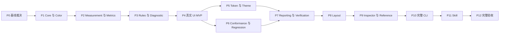

# UIQ-PLAN-01 V1.0 分阶段架构实现计划

| 项目     | 内容                                                                                                  |
| -------- | ----------------------------------------------------------------------------------------------------- |
| 版本     | 1.0.0                                                                                                 |
| 性质     | 工程执行计划；不新增核心架构，不修改规范语义                                                          |
| 架构依据 | [UIQ-ARCH-01 V1.0 完整工程架构设计](<./UIQ-ARCH-01 V1.0 完整工程架构设计.md>)                         |
| 规范依据 | `specs/` 中的 43 份规范；完整索引沿用架构文档附录 A                                                   |
| 实施范围 | 13 个领域/运行时包、Radix Integration、4 个应用、布局专项、CLI/Skill、测试与 CI                       |
| 阶段组织 | P0～P12，共 13 个阶段、65 个任务；映射源规范 M1～M15                                                  |
| 当前基线 | HEAD `5515fa2`；已有 P0～P7 实现及 P8 布局采集/CLI 多命令提交；三浏览器 Light/Dark 矩阵已接通；本地工程验证见附录 E；不代表 P2～P8 退出门禁通过 |
| 初始状态 | 本文初建时所有任务为 NOT_STARTED；该历史状态不再代表当前工程，实际证据以附录 E 为准                                                                |
| 本次交付 | 能力目录、独立数学基线、源码架构检查、Core/Color 浏览器 smoke、最小 CI、P8 布局采集与配置、CLI 多命令扩展、三浏览器 Light/Dark Playwright 矩阵；已提交至 main，未推送或发布 |

## 1. 执行原则

1. **先冻结契约，再实现算法与执行链。** 采用 ARCH-01 的 AD-01～AD-25 裁决，禁止从多份规范复制互相冲突的同名类型。
2. **先形成真实 UI 的可验证闭环，再扩充能力。** P4 必须证明 Button → 测量 → 指标 → 评价 → Finding → Diagnostic → CLI 可运行。
3. **直接实现正式接口。** MVP 只缩小注册能力与输入范围，不创建临时 Engine，不用固定值或成功占位返回冒充实现。
4. **按能力增量创建包。** 目录与包名从 P0 固定，不要求 P1 创建全部空包；只对已有真实实现注册能力。
5. **测量、计算、评价、解释、建议、验证与发布政策分离。** UNKNOWN 不转换为 PASS/FAIL；未执行、目标消失和手工确认不代表修复。
6. **测试随能力进入。** 架构、Schema、Golden、错误路径和确定性测试不是最后阶段补写；P12 负责全量组合验收。
7. **保留实际证据。** 阶段完成由构建产物、测试结果与可重放 Artifact 证明，不依据代码行数或人工填写的“完成”。
8. **不虚设排期。** 当前没有团队容量和交付日期信息，本计划按依赖和验收门禁推进；实际日历排期在任务认领后制定。

正文任务表描述目标范围；实际已经落地的路径、命令和验收证据见附录 E，不得仅凭规划文本推断实现完成。任务编号可作为后续工单标题，人员未确定时使用角色分工，不虚构负责人。

## 2. 阶段总览与依赖

### 2.1 阶段一览

“前置阶段”指该阶段退出门禁已经通过；能力准备和测试夹具草拟可提前进行，但不得提前宣布阶段完成。

| 阶段 | 阶段名称                                    | 前置阶段 | 主要结果                                   | 规范里程碑映射       |
| ---- | ------------------------------------------- | -------- | ------------------------------------------ | -------------------- |
| P0   | 实施基线与契约裁决                          | 无       | 包边界、契约清单、注册清单、Golden 依据    | M1 前置              |
| P1   | 工程底座、Core 与 Color                     | P0       | 可构建平台无关内核与颜色数学               | M1                   |
| P2   | Geometry、Measurement 与 Metrics            | P1       | 可对离线快照执行指标 DAG                   | M2、M3               |
| P3   | Rules、Finding 与 Diagnostic                | P2       | 可重放的离线评价与解释链                   | M4、M5               |
| P4   | Browser 与第一条真实 UI 闭环                | P3       | Chromium Button MVP、最小 CLI/Reference    | M7/M9/M11 的首批能力 |
| P5   | Token、Theme 与 Radix 集成                  | P4       | 设计系统双轨验证与主题隔离                 | M6；扩充 M7/M10/M11  |
| P6   | Conformance 与 Regression                   | P4       | 技术契约验证、可比性与基线差异             | M8；高等级验收延后   |
| P7   | Reporting、Recommendation 与 Verification   | P5、P6   | 报告、建议与重测验证服务                   | M13                  |
| P8   | Layout 完整运行链                           | P7       | 九项布局指标、十一项规则、页面聚合与数据集 | Layout 专项          |
| P9   | Inspector、Playground 与 Reference 完整应用 | P8       | 可交互证据链、布局视图及验证闭环           | M10、M11、M14        |
| P10  | 完整 CLI 与自动化协议                       | P9       | 八命令、JSON 契约、退出码与 CI 集成        | M9；M12 自动化能力   |
| P11  | Agent Skill 集成                            | P10      | 单一 Skill 入口与证据型工作流              | Skill 专项           |
| P12  | 全量回归、工程加固与发布候选                | P11      | 三浏览器完整验收、CI 门禁和候选产物        | M12、M15             |

P5 与 P6 是两个可并行分支，其余为默认验收顺序。M 编号表示规范能力归属，不表示必须逐号完成后才能提前实现 Browser/CLI 外壳。每阶段五个任务默认按编号推进；第 17 节明确允许的任务可在接口冻结后并行，其余任务不得跳过本阶段前置产物。

### 2.2 阶段依赖图

下图箭头表示前置交付依赖，不表示包 import。

### 2.3 交付门禁

| 门禁 | 对应阶段 | 可以证明                           | 不能宣称                             |
| ---- | -------- | ---------------------------------- | ------------------------------------ |
| G0   | P0       | 实施依据和冲突处理已收敛           | 代码可运行                           |
| G1   | P1～P3   | 离线确定性评价链成立               | 能测量真实 UI                        |
| G2   | P4       | Chromium 上真实 Button 闭环成立    | 完整主题、布局、报告或三浏览器符合性 |
| G3   | P5～P7   | 设计系统、回归、建议和验证服务可用 | 完整 Inspector/Skill 已完成          |
| G4   | P8～P11  | V1.0 功能与集成范围具备            | 所有跨环境验收已通过或已发布         |
| G5   | P12      | 本计划范围内发布候选通过全量验收   | 已执行 npm 发布、部署或外部交付      |

这里的 G0～G5 是交付门禁；布局规范的 G1～G14 是 Golden 数据集分类，两套编号不能互相替代，验收记录必须注明“门禁”或“布局数据集”。

## 3. P0：实施基线与契约裁决

**目标：** 把架构设计转为实现者可直接遵循的契约与能力清单，关闭已知定义冲突。主责角色为架构/运行时负责人，测试角色共同确认数学基线。

### 3.1 任务与交付物

| 任务  | 工作内容                                                     | 目标位置/交付物                          | 验证要求                                                     |
| ----- | ------------------------------------------------------------ | ---------------------------------------- | ------------------------------------------------------------ |
| P0-01 | 固定 13 包、4 应用和集成边界；记录生产依赖白名单             | ARCH-01 §4 对应的工程边界清单            | 不新增 layout/runtime/AI 核心包，无循环依赖设计              |
| P0-02 | 确认 core 类型、时间、依赖 trace、状态、指纹与导入 dialect   | core/measurement/CLI 的契约清单          | 覆盖 AD-02/04/06/07/08/09，类型归属唯一                      |
| P0-03 | 列出指标、规则、建议规则、Token/布局契约的精确身份与支持计划 | 机器可读注册清单设计，后续归属相应包     | 区分 planned 与实际可用；无 latest、隐式别名                 |
| P0-04 | 制定 Golden 输入、期望推导、容差、版本及矩阵                 | `tests/golden/` 的夹具清单与独立推导记录 | 色彩约值不能直接充当精确真值；布局含方向、并集裁剪等冲突案例 |
| P0-05 | 将 AD-01～25、AC-ARCH-01～14 分配到阶段和责任角色            | 本计划附录矩阵的执行登记                 | 每项有落点；FM-01 缺失及非支持能力显式登记                   |

### 3.2 退出条件

- 对 Measurement/MetricResult/Evaluation/Finding/Report/CLI 等边界的差异已有唯一实施方案。
- 关键算法和状态的 Golden 期望有可核验来源；不能用未来实现自身生成期望来关闭 P0。
- 缺失 FM-01 的处理采用 ARCH-01 临时契约基线并保留限制；不以“以后补文档”删除风险。

**不做：** 大范围搭空壳、开发业务功能、重新讨论已冻结产品维度。

**交接：** P1 按清单创建核心类型与测试；后续专项只补细化 Schema，不改变已确定的核心语义。

## 4. P1：工程底座、Core 与 Color

**前置：** P0。**目标：** 建立真正能构建、测试、跨环境加载的内核。主责角色为运行时开发，测试角色维护独立 Golden。

### 4.1 任务与交付物

| 任务  | 工作内容                                                                     | 目标位置/交付物                                                           | 验证要求                                                                 |
| ----- | ---------------------------------------------------------------------------- | ------------------------------------------------------------------------- | ------------------------------------------------------------------------ |
| P1-01 | 初始化 pnpm workspace、TS strict、ESM 构建、Vitest、ESLint/Prettier、最小 CI | 根配置、`.github/workflows/ci.yml`                                        | Node 24 LTS/pnpm 10 锁定精确工具版本；安装、类型检查、构建可重复         |
| P1-02 | 实现核心实体/测量/指标/规则/评价/证据/诊断类型与 Schema 描述                 | `packages/core/src/`、`packages/core/schemas/`                            | AVAILABLE/UNKNOWN/ERROR、六种评价状态、Severity 与生命周期分别校验       |
| P1-03 | 实现 Registry 基元、Canonical JSON、SHA-256、稳定身份与时间注入              | `core/src/registry/`、`core/src/fingerprint/`                             | 重复注册失败、版本隔离、键顺序不影响哈希、有序数组不被重排               |
| P1-04 | 实现颜色解析、空间转换、亮度/对比度、ΔL/ΔC/ΔH、色域及透明合成                | `packages/color/src/`                                                     | 黑白 21、同色 1、Hue 环绕、无彩色、alpha、色域边界及往返测试             |
| P1-05 | 建立架构导入、公共 exports、核心数学 Golden 与纯库浏览器加载 smoke test      | `tests/architecture/`、`tests/golden/color/`、`tests/browser/core-smoke/` | 测试宿主可用 Playwright；core 不含 DOM/Node/框架依赖；公共构建产物能加载 |

### 4.2 退出条件

- core 与 color 真实构建并通过相关测试；不是空测试或允许无测试通过。
- 数学输出确定；不通过先舍入、丢 alpha、提前 clamp 让 Golden 通过。
- Node 构建产物与隔离浏览器模块加载 smoke test 证明核心不依赖平台 API；这不是 Browser Measurement 验收。

**不做：** DOM 采集、指标 DAG、规则评价器、推荐或配色生成。APCA/特定 ΔE 方法没有冻结算法时不注册为可用。

**交接：** 提供公共声明、Schema、版本化数学 Golden 和基础 CI 命令，进入 P2。

## 5. P2：Geometry、Measurement 与 Metric Execution

**前置：** P1。**目标：** 让离线快照成为可信且可复算的指标输入。主责角色为运行时开发。

### 5.1 任务与交付物

| 任务  | 工作内容                                                | 目标位置/交付物                                     | 验证要求                                                     |
| ----- | ------------------------------------------------------- | --------------------------------------------------- | ------------------------------------------------------------ |
| P2-01 | 实现矩形、面积、交并集、距离和轴坐标函数                | `packages/geometry/src/`                            | 负坐标、零面积、非法尺寸、交集/并集、输入不变性              |
| P2-02 | 实现测量校验、单位归一、SnapshotBuilder 和来源记录      | `packages/measurement/src/`                         | CSS px、缺值状态、唯一 ID、来源版本、采集上下文与快照不可变  |
| P2-03 | 实现 MetricRegistry、依赖解析、DAG Planner 与执行上下文 | `packages/metrics/src/{registry,engine,execution}/` | 环路路径、必需/可选依赖、精确版本、禁止指标主动访问 Registry |
| P2-04 | 实现正式首批颜色、排版、几何指标及间距基础能力          | `metrics/src/builtins/`、对应 Schema                | 输入/输出/单位/支持状态与注册清单一致，不混入 PASS/FAIL      |
| P2-05 | 实现会话缓存、稳定排序、异常隔离和离线执行 Artifact     | `metrics/src/execution/`、`tests/integration/`      | 配置参与缓存键；不同快照不串用；重复执行语义结果一致         |

### 5.2 退出条件

- 固定测量快照可离线执行指标依赖闭包并输出完整 MetricResult/trace。
- 有效输入、UNKNOWN、ERROR、可选依赖缺失和环路均有测试；一次局部失败不污染其他目标。
- 基础单位、精度、身份及配置哈希一致；后续 Rule 不需要解析 DOM 或重算颜色。

**不做：** 完整布局九指标、Token 绑定推断和视觉评价；这些分别归 P8、P5、P3。

**交接：** 将真实格式的离线快照与指标结果交给 P3；这些夹具不是浏览器实测证明。

## 6. P3：Rule Evaluation、Finding 与 Diagnostic

**前置：** P2。**目标：** 完成离线 `Snapshot → Metrics → Rules → Finding → Diagnostic` 链。主责角色为规则/诊断开发。

### 6.1 任务与交付物

| 任务  | 工作内容                                                  | 目标位置/交付物                                            | 验证要求                                                                |
| ----- | --------------------------------------------------------- | ---------------------------------------------------------- | ----------------------------------------------------------------------- |
| P3-01 | 实现 RuleRegistry、请求/配置校验与精确指标匹配            | `packages/rules/src/{registry,engine}/`                    | 配置不能改 Rule/Metric 身份；版本不匹配显式错误                         |
| P3-02 | 实现 Operator、Range、Applicability、Tolerance 和六态传播 | `rules/src/{operators,ranges,tolerance}/`                  | N/A 与 UNKNOWN 短路，ERROR 不继续比较；普通文本 Contrast≈4.48 必须 FAIL |
| P3-03 | 实现 PolicyProfile 和基本 Release Gate 事实接口           | `rules/src/{policy,release}/`                              | ALLOW/WARN/BLOCK 与 Evaluation 分离；后续回归输入只通过 DTO 注入        |
| P3-04 | 实现 Finding 工厂、Evidence 引用、生命周期与指纹          | `packages/diagnostic/src/`                                 | 默认 FAIL/WARN 创建问题；UNKNOWN/ERROR 保留性质；原评价不可变           |
| P3-05 | 实现诊断原因分类、confidence、解释与来源追踪              | `diagnostic/src/{evidence,trace,root-cause}/`、诊断 Golden | 无绑定时不伪造 Token 根因；离线链可重放且保留全部引用                   |

### 6.2 退出条件

- 有效/失败/未知/执行错误的离线夹具均可输出一致的评价与解释。
- 业务允许偏差、数值 epsilon、Golden tolerance 分离；Severity 不改变事实判断。
- Rule 只消费指标，Diagnostic 不重算或改写 Evaluation；相关架构测试通过。

**不做：** Recommendation、报告渲染和浏览器自动化。Policy 的回归/Conformance 联合输入在 P6、P10 补齐。

**交接：** 离线分析接口、错误模型、证据索引成为 P4 Browser/CLI 的正式输出契约。

## 7. P4：Browser 与第一条真实 UI 垂直切片

**前置：** P3。**目标：** 尽早在 Chromium 证明测量事实与离线内核能够接通。主责角色为浏览器适配/工具开发。

### 7.1 任务与交付物

| 任务  | 工作内容                                                            | 目标位置/交付物                              | 验证要求                                                                                    |
| ----- | ------------------------------------------------------------------- | -------------------------------------------- | ------------------------------------------------------------------------------------------- |
| P4-01 | 实现 DOM 实体映射与颜色/几何/排版基础采集                           | `packages/browser/src/`                      | 稳定 data-uiq-id，来源与实际样式保留，Adapter 不执行 Metrics/Rules                          |
| P4-02 | 实现背景链/alpha、未知背景、环境记录和稳定采集                      | `browser/src/{color,environment}/`           | 透明不能默认白底；渐变 UNKNOWN；字体/布局就绪，CSS px 与 DPR 不混淆                         |
| P4-03 | 实现隔离 BrowserExecutor、权限校验、超时与 finally 清理             | `apps/cli/src/browser/`                      | Playwright 仅存在宿主；导航失败/取消清理；仅访问授权目标                                    |
| P4-04 | 建立 Button Reference 夹具和最小 measure/analyze JSON 命令          | `apps/reference/`、`apps/cli/src/commands/`  | 使用正式接口；stdout JSON、stderr 日志；未支持命令显式拒绝                                  |
| P4-05 | 实现真实浏览器采集和离线重放等价测试，落实 P0 的分析产物交换 Schema | `tests/browser/`、`tests/e2e/`、CLI 产物契约 | 白黑 PASS、灰白 FAIL、渐变 UNKNOWN；保存测量及已完成阶段的完整分析记录，不包含虚构建议/报告 |

### 7.2 退出条件：G2 / MVP

- 在真实 Chromium 打开 Reference Button，采集后得到 `COLOR.CONTRAST@1.0.0`、WCAG 评价、Finding、Diagnostic 与 Evidence。
- 同一个保存快照离线运行得到等价领域结果；浏览器失败时不输出伪质量结论。
- 灰白约 4.48 的场景失败；改为白字/蓝底约 5.17 后新评价通过。此时只证明重新评价，不宣称 Regression/Verification 已实现。
- CLI 的最小能力可使用，尚未支持的建议/报告等阶段以覆盖信息注明；不能伪造完整结果数组或将整个项目标为通过。

**不做：** 暂不交付 Firefox/WebKit 完整符合性、完整 Inspector、布局专项和 Skill。

**交接：** P5 获得真实测量；P6 获得真实 Baseline/Current 样本。browser 只依赖已需要的白名单子集，不为缺少 Token 模块添加假实现。

## 8. P5：Token、Theme 与 Radix 集成

**前置：** P4。**目标：** 形成设计意图与实际 UI 的双轨验证。可与 P6 并行；主责角色为设计系统/运行时开发。

### 8.1 任务与交付物

| 任务  | 工作内容                                                   | 目标位置/交付物                                 | 验证要求                                                          |
| ----- | ---------------------------------------------------------- | ----------------------------------------------- | ----------------------------------------------------------------- |
| P5-01 | 实现 Token 导入 dialect、layer/valueType 分离及资产 Schema | `packages/tokens/src/model/`、`tokens/schemas/` | 历史 type 含义显式转换，不按字符串猜测；保留资产版本              |
| P5-02 | 实现引用图、解析链、cycle/orphan/断裂引用与影响追踪        | `tokens/src/{graph,resolution,trace,impact}/`   | 完整环路路径；ORPHAN≠INVALID；无 DOM/Color/Rule 依赖              |
| P5-03 | 实现主题覆盖、状态上下文与多主题独立解析                   | `packages/theme/src/`                           | Light/Dark 不平均，主题/状态/覆盖配置纳入身份与缓存               |
| P5-04 | 实现 Radix 组件标识、Portal/状态与三类绑定投影             | `integrations/radix/`、`browser` 绑定适配       | EXPLICIT/INFERRED/UNRESOLVED 保真；数值相等不证明 Token 使用来源  |
| P5-05 | 注册 Token 指标并整合组件/主题与 Accessibility 双轨样例    | `metrics`、`rules`、`apps/reference/`           | TOKEN.RESOLUTION/MATCH/DEVIATION 身份统一；Token 匹配与对比度独立 |

### 8.2 退出条件

- 真实 Button/Input/Card/Dialog 在目标 Light/Dark 状态下能展示期望、实际、绑定证据和评价。
- Token 环路、缺失引用、误绑定、手写等值、主题覆盖和 Portal 归属都有反例测试。
- tokens/theme 不为方便新增禁止依赖；数学和规则由对应包处理，应用只做投影与编排。

**不做：** Token 编辑器、主题生成、自动改色或自动 CSS 修复。

**交接：** 为 P7 提供已解析的 Token/Theme/Component 和影响 DTO；P6 在分支合流时增加这些真实样本的回归测试。

## 9. P6：Conformance 与 Regression

**前置：** P4。**目标：** 证明实现契约和前后变化可被客观验证。可与 P5 并行；主责角色为测试基础设施/回归开发。

### 9.1 任务与交付物

| 任务  | 工作内容                                                                          | 目标位置/交付物                                   | 验证要求                                                                   |
| ----- | --------------------------------------------------------------------------------- | ------------------------------------------------- | -------------------------------------------------------------------------- |
| P6-01 | 实现 Schema/Contract/Golden 校验与被测函数注入                                    | `packages/conformance/src/`                       | 生产 conformance 只依赖 core，不直接 import 被测引擎或 Playwright          |
| P6-02 | 复用 P4 的分析产物交换形状，补齐 AnalysisSnapshot/Baseline 公共契约与显式批准流程 | `packages/regression/src/baseline/`、应用存储适配 | 兼容前阶段真实产物，不重复定义领域类型；基线保留版本/环境/配置，不默认覆盖 |
| P6-03 | 实现稳定目标匹配、内容指纹与逻辑问题键分离                                        | `regression/src/diff/`                            | 数值变化不会打断同一逻辑问题；临时 ID/数组序号不充当长期身份               |
| P6-04 | 实现六类回归、可比性与缺失目标处理                                                | `regression/src/{classification,report}/`         | 版本/环境不一致不能伪判修复；UNKNOWN 恢复可用不等于规则 PASS               |
| P6-05 | 接入技术等级执行清单与回归 Artifact，形成 Gate 输入 DTO                           | 测试 harness、CLI 内部适配                        | 已实现范围按清单校验；缺少用例不能报全等级通过；不重跑 Rule                |

### 9.2 退出条件

- 六种回归分类和不可比、ERROR、缺失目标都有精确断言；FAIL→FAIL 不重复计为一般变化。
- 已实现范围的技术契约测试通过；尚未完成的 Theme/Reporting/Layout 用例保持“待覆盖”，不能宣称 FULL。
- 真实 P4 前后快照可得到 FIXED_FAILURE；未重新测量或没有 Baseline 不生成回归结论。

**不做：** 自动接受 Golden 差异、自动升级 Baseline、伪造层级 Conformance 通过。

**交接：** 提供纯 Conformance/Regression 接口及事实 DTO，P7/P10 无需直接依赖浏览器来消费结果。

## 10. P7：Reporting、Recommendation 与 Verification

**前置：** P5 与 P6 均完成。**目标：** 把事实组织成可读报告与可执行验证条件。主责角色为报告/运行时开发。

### 10.1 任务与交付物

| 任务  | 工作内容                                                       | 目标位置/交付物                               | 验证要求                                                         |
| ----- | -------------------------------------------------------------- | --------------------------------------------- | ---------------------------------------------------------------- |
| P7-01 | 实现 QualityReportInput/UIQualityReport、Scope、摘要与维度聚合 | `packages/reporting/src/{model,aggregation}/` | 六态总和等于评价数；聚合去重，原始结果不丢失                     |
| P7-02 | 实现 Finding 分组、Diagnostic 关联及影响投影                   | `reporting/src/{diagnostic,impact}/`          | 不按 message 聚类、不重新归因；保留成员 IDs 与来源               |
| P7-03 | 实现 Recommendation Registry 与首批领域建议                    | `reporting/src/recommendation/`               | 精确版本、建议去重、affectedFindingIds、无隐藏阈值/替换颜色      |
| P7-04 | 实现 VerificationCriterion 与新结果验证投影                    | `reporting/src/verification/`、应用重测编排   | 新采集且全部必需条件满足才 VERIFIED；N/A、消失、版本变化不算修复 |
| P7-05 | 实现 JSON/Markdown/HTML Renderer 和报告确定性                  | `reporting/src/{generator,renderer}/`         | HTML 上下文转义、稳定排序/时间、不重新执行指标/规则/诊断         |

### 10.2 退出条件

- 基于同一完整分析产物可重复生成等价报告，每条建议回链到具体事实。
- “生成报告”不启动浏览器或引擎；仅测量快照输入不能被暗中扩展成完整分析。
- 通过应用编排完成建议→外部修改→新采集→评价→回归→验证测试；此时可为程序化流程，不要求完整 Inspector。

**不做：** UI 总分、设计自动修改、在 reporting 内访问 Token/Browser 实现。

**交接：** 提供报告模型/Schema、Renderer、建议与验证接口，P8 扩展布局报告，P9 消费 UI 视图。

## 11. P8：Layout 完整运行链

**前置：** P7。**目标：** 在现有包内完成布局采集、九指标、十一规则、聚合、验证和回归。主责角色为布局指标/规则开发，测试角色维护 G1～G14。

### 11.1 任务与交付物

| 任务  | 工作内容                                              | 目标位置/交付物                                                   | 验证要求                                                                 |
| ----- | ----------------------------------------------------- | ----------------------------------------------------------------- | ------------------------------------------------------------------------ |
| P8-01 | 实现布局元素/组/关系 DTO、subjectIds 归一、参考和来源 | `measurement`、`browser/src/layout/`、`metrics/src/layout/types/` | 不跨禁止包导入类型，不猜测组、轴、配对或组件关系                         |
| P8-02 | 实现九项指标与跨快照输入投影                          | `metrics/src/layout/`、`geometry`                                 | 有向对齐偏差、正负网格、裁剪 UNION_AREA、RAW 可>1、方差、响应式来源      |
| P8-03 | 实现十一项 Rule、Token/组件约束解析及冲突追踪         | `rules/src/layout/`、调用方配置适配                               | 容差不双重放宽；CONSTRAINT_CONFLICT 显式；ORDER 比较同轴有向偏差         |
| P8-04 | 实现布局诊断/建议及 Page/Region/Component 汇总        | `diagnostic`、`reporting/src/layout/`、`regression` 适配          | 父子聚合不重复计数，保留 Finding/Constraint/主题/viewport 身份           |
| P8-05 | 完成布局 Reference 页和 G1～G14 数据集                | `apps/reference/src/layout/`、`tests/golden/layout/`              | 所有专项类别有夹具和断言；截图不是唯一期望；真实采集与离线 Golden 都覆盖 |

### 11.2 必须交付的能力清单

| 类别        | 完整范围                                                                                                                                                                                                                                                   |
| ----------- | ---------------------------------------------------------------------------------------------------------------------------------------------------------------------------------------------------------------------------------------------------------- |
| 九项 Metric | ALIGNMENT、GRID_ALIGNMENT、DENSITY、SYMMETRY、OVERFLOW、RESPONSIVE_SIZE_DELTA、RESPONSIVE_POSITION_DELTA、COMPONENT_SIZE_VARIANCE、SPACING_VARIANCE，均属 LAYOUT 域                                                                                        |
| 十一项 Rule | ALIGNMENT.CONFORMANCE、GRID.CONFORMANCE、SPACING.CONFORMANCE、CONTAINER.CONSTRAINT、OVERFLOW.CONSTRAINT、DENSITY.RANGE、SYMMETRY.CONFORMANCE、COMPONENT.SIZE_CONSISTENCY、RESPONSIVE.CONSTRAINT、RESPONSIVE.NO_OVERFLOW、ORDER.CONFORMANCE，均属 LAYOUT 域 |
| G1～G14     | Geometry、Alignment、Grid、Spacing、Container、Density、Symmetry、Overflow、Responsive、Component Consistency、Design System、Theme、Regression、Unknown/Error                                                                                             |

### 11.3 退出条件

- 九指标/十一规则全部有精确版本、输入/输出 Schema、状态语义与 Golden，不因示例代码不完整漏掉 ORDER。
- 缺少组/配对/响应式目标时 UNKNOWN；RAW 与 UNION 密度不混淆；参考实现绝对偏差数组不能冒充正式有向结果。
- P8 在 Chromium 验证布局闭环；Firefox/WebKit 的完整矩阵在 P12 关闭，不提前声明 BROWSER/FULL。
- 报告只聚合已有结果；不存在独立 `@uiq/layout` 或新的质量评分层。

**不做：** AI 布局意图推断、自动布局优化、任意阅读顺序猜测。

**交接：** 完整布局 Artifact 和 Reference 页供 P9 交互展示、P12 跨浏览器验收。

## 12. P9：Inspector、Playground 与 Reference 完整应用

**前置：** P8。**目标：** 将正式领域能力转为可用的交互产品。主责角色为前端/集成开发。

### 12.1 任务与交付物

| 任务  | 工作内容                                                         | 目标位置/交付物                                     | 验证要求                                                                               |
| ----- | ---------------------------------------------------------------- | --------------------------------------------------- | -------------------------------------------------------------------------------------- |
| P9-01 | 实现 Inspector Facade、session/requestSequence 与状态管理        | `apps/inspector/src/{runtime,state}/`               | 旧异步结果不能覆盖新目标/主题；切换与取消清理资源                                      |
| P9-02 | 实现三栏 UI、目标选择与隔离 Overlay                              | `inspector/src/{panels,overlay}/`                   | Overlay 不进入采集；同源范围明确，跨源使用产物导入                                     |
| P9-03 | 实现 Measurement→Metric→Rule→Finding→Diagnostic→Token/Trace 浏览 | Inspector 证据面板与布局视图                        | 保留六态、Severity、confidence、原始引用和数值精度                                     |
| P9-04 | 接入 Reporting/Recommendation/Verification/Regression 与导入导出 | Inspector 报告与验证面板                            | UI 不重算；重测后验证；目标消失不可显示修复成功                                        |
| P9-05 | 完善 Reference/Playground 和 UI 端到端测试                       | `apps/reference/`、`apps/playground/`、`tests/e2e/` | Button/Input/Card/Dialog、主题、布局、未知/失败/修复场景可控；CLI/Inspector 同输入等价 |

### 12.2 退出条件

- 用户能选中真实元素，查看事实、原因、影响、建议，再对外部修改进行重新测量和验证。
- 快速切换目标/主题、取消、导出错误、过期结果和受限 DOM 情况不污染会话。
- Reference 是测试样本，Playground 是调试应用，二者都没有重复质量算法。

**不做：** 设计编辑器、Token 编辑器、绕过同源策略或默认自动修复。

**交接：** P10 将 inspect 交互入口与一次性 JSON 模式接入完整 CLI，P12 验证打包后应用。

## 13. P10：完整 CLI 与自动化协议

**前置：** P9。**目标：** 对开发者、CI 与 Skill 提供稳定自动化契约。主责角色为工具/CI 开发。

### 13.1 任务与交付物

| 任务   | 工作内容                                                   | 目标位置/交付物                                | 验证要求                                                                         |
| ------ | ---------------------------------------------------------- | ---------------------------------------------- | -------------------------------------------------------------------------------- |
| P10-01 | 补齐八命令及统一请求/配置解析                              | `apps/cli/src/{commands,config,runtime}/`      | inspect/measure/analyze/evaluate/conformance/regression/snapshot/report 边界明确 |
| P10-02 | 实现浏览器/离线模式与三类产物输入校验                      | CLI 输入和存储适配                             | measure 输出测量快照；snapshot 保存分析；report 不暗中执行分析                   |
| P10-03 | 完成 JSON Envelope、stdout/stderr、六退出码与错误优先级    | `cli/src/{output,exit-code}/`、请求响应 Schema | 非零退出保留合法错误 JSON；PARTIAL 不伪装完整；0 不等于全部 PASS                 |
| P10-04 | 完成 Artifact 输出、路径安全、敏感信息处理与进程取消       | CLI I/O、BrowserExecutor                       | 原子输出、显式 Baseline、授权 URL/重定向范围、不继承宿主凭据                     |
| P10-05 | 集成 Conformance/Regression/Policy Release Gate 与 CI 调用 | `rules` 政策事实适配、CI workflow              | 工程测试失败不能被 UI onFail=WARN 绕过；失败仍归档并清理                         |

### 13.2 退出条件

- 八命令有成功、输入错误、配置错误、执行错误、UNKNOWN/PARTIAL 等适用测试。
- 退出码固定为 0 SUCCESS、1 POLICY_BLOCK、2 CONFORMANCE_FAILURE、3 EXECUTION_ERROR、4 INVALID_CONFIGURATION、5 INPUT_ERROR。
- 离线输入不启动 Playwright、不联网补齐缺失配置；完整分析结果可供 Skill 逐层读取。
- 从构建后的 CLI 执行验证，不只在 TS 源码测试环境中通过。

**不做：** 为领域工作流新增 color/accessibility/verify 等并列 CLI 引擎；工作流复用八命令与 Scope 配置。

**交接：** 提供冻结的 CLI Request/Response、退出码、帮助和示例 Artifact，进入 P11。

## 14. P11：Agent Skill 集成

**前置：** P10。**目标：** 让 Agent 调用 UIQ 获取证据，不产生第二套质量判断。主责角色为 Agent 工具集成开发。

### 14.1 任务与交付物

| 任务   | 工作内容                                                | 目标位置/交付物                                               | 验证要求                                                           |
| ------ | ------------------------------------------------------- | ------------------------------------------------------------- | ------------------------------------------------------------------ |
| P11-01 | 建立单一 uiq-ui-quality 入口及精简分发目录              | `skills/uiq-ui-quality/SKILL.md`、`workflows/`、`references/` | 采用 SKILL-03；不复制 CLI Schema 成第二事实源                      |
| P11-02 | 实现意图/目标/Scope/主题/浏览器/基线到 CLI 的工作流映射 | 十类既定工作流文档与调用适配                                  | 目标明确；领域选择映射配置；缺少 Baseline 不声称已比较             |
| P11-03 | 实现安全进程调用与机器结果消费                          | 宿主集成与 CLI 契约测试                                       | 参数数组启动，不拼 shell；解析 JSON，不从终端文案判断质量          |
| P11-04 | 实现摘要、证据追踪、建议解释与验证工作流                | references 与演示样例                                         | 状态/Severity/confidence 保真；先摘要后证据，不塞入全量 DOM        |
| P11-05 | 验证错误、权限与不可信内容边界                          | Skill 行为与集成验收用例                                      | 不改 PASS/FAIL、不补根因、不执行页面指令、不自动修改或 commit/push |

### 14.2 退出条件

- inspect、analyze、accessibility、color、typography、design-system、theme、regression、report、verify 工作流都能映射到正式 CLI 能力。
- 使用真实 Artifact 完成一次分析、解释、修改后验证和回归演示；CLI 错误有诚实且明确的解释。
- Skill 没有数学算法、隐藏阈值、整体分数或重复注册中心；不要求外部 LLM 才能运行 UIQ 内核。

**不做：** 自动代码修复、自动提交推送、多 Skill 无边界拆分或组织治理平台。

**交接：** Skill 包、调用契约与行为测试纳入 P12 最终候选验收。本次计划编写不生成这些 Skill 文件。

## 15. P12：全量回归、工程加固与发布候选

**前置：** P11，且 P0～P10 所有阶段门禁均已通过。**目标：** 证明完整范围在目标环境可重复构建、运行、解释和验证。主责角色为测试/发布工程，所有模块责任角色参与。

### 15.1 任务与交付物

| 任务   | 工作内容                                               | 目标位置/交付物                | 验证要求                                                                    |
| ------ | ------------------------------------------------------ | ------------------------------ | --------------------------------------------------------------------------- |
| P12-01 | 执行三浏览器、Light/Dark、规定 viewport/状态的完整矩阵 | Playwright 项目与测试 Artifact | 每组合独立快照；覆盖率完整；不平均差异或以跳过当通过                        |
| P12-02 | 执行 CORE/STANDARD/BROWSER/FULL 与 G1～G14 全量回归    | Conformance/Regression 汇总    | 全部必需用例有结果；Golden 与 Baseline 更新必须显式评审                     |
| P12-03 | 验证完整 E2E、错误注入、取消清理和安全边界             | `tests/e2e/`、CI 归档          | 实际 UI→建议→修改→新采集→验证→回归→门禁→报告；无凭据泄漏                    |
| P12-04 | 性能基线、重复性与构建产物兼容性加固                   | 基准数据、库/CLI/App 候选包    | 记录规模/环境/耗时/内存；无虚设 SLA；Browser bundle 无 Node/Playwright 泄漏 |
| P12-05 | 汇总 AC/AD 关闭证据、支持清单、剩余限制与回退资料      | 版本化发布候选及验收记录       | 全部验收可追溯；声明支持与实测范围一致；不自动发布或部署                    |

### 15.2 退出条件：G5

- AC-ARCH-01～14 全部必需子项有执行证据；明确排除的非 V1.0 能力不能计入通过率。
- 13 个包、4 个应用、Radix 集成和 Skill 在候选版本下可用；离线分析与报告不依赖浏览器或后端。
- 从干净环境冻结安装、构建、执行完整 CI；测量、规则、报告和回归结果能够重放。
- 失败/UNKNOWN/ERROR 与发布政策区分清楚；所有完整性错误及发布阻断问题处理完成。
- 最终提供候选 Artifact、测试报告、配置/版本/环境清单及已知限制；外部发布、提交、推送和部署另需明确授权。

**不做：** 自动批准风险、绕过失败检查、为了按期结束删除失败用例。

## 16. 跨阶段测试与质量门禁

### 16.1 每个任务的完成定义

任务从 NOT_STARTED 进入 IN_PROGRESS，提交验证后进入 READY_FOR_ACCEPTANCE，取得验收证据后才进入 DONE；阻塞标 BLOCKED。任务状态不得复用 UIQ EvaluationState。

每个任务完成必须满足：

- 实现符合所属包职责与公共契约，无新增禁止依赖。
- 新增能力有单元/契约/Golden 中适用的测试，也有无效输入与 UNKNOWN/ERROR 路径。
- 对当前阶段已具备的能力提供对应证据：P0 用契约/推导记录，P1～P3 用离线测试，P4 起增加实测快照，P6 起增加回归结果；没有自动重写期望值来消除失败。
- 类型、Schema、注册清单与实现一致；未实现能力未注册为 AVAILABLE。
- 验收记录包含任务 ID、源版本/工作区标识、命令、退出状态、测试范围、Artifact 位置和已知限制。
- 运行记录不含凭据或敏感页面原文；有需要时导出脱敏投影而非破坏原始事实。

### 16.2 目标验证命令

以下为实施阶段的命令契约，由 P1/P2 开始逐步建立；当前已接通的命令及实测结果见附录 E。检查脚本缺失或实际用例为零时，应作为门禁未满足，不能以“未配置”为通过。

| 命令                                               | 引入阶段                             | 验证范围                                               |
| -------------------------------------------------- | ------------------------------------ | ------------------------------------------------------ |
| `pnpm install --frozen-lockfile`                   | P1 生成并确认 lockfile 后            | 冻结依赖可重复安装                                     |
| `pnpm lint`、`pnpm format:check`、`pnpm typecheck` | P1                                   | 风格与类型完整性                                       |
| `pnpm test:architecture`                           | P1                                   | 包白名单、无环、公共 exports、平台隔离                 |
| `pnpm test:unit`、`pnpm test:golden`               | P1 起扩充                            | 纯算法、状态与独立数学期望                             |
| `pnpm test:schema`、`pnpm test:contract`           | P1 起扩充                            | 类型/JSON 边界、引用与版本                             |
| `pnpm build`                                       | P1 起扩充                            | 现有真实包和应用的构建产物                             |
| `pnpm test:integration`                            | P2 起                                | 包之间的真实数据链                                     |
| `pnpm test:browser`                                | P1 纯库加载 smoke，P4 起扩充采集测试 | 区分内核加载与真实 UI 测量验收                         |
| `pnpm test:e2e`                                    | P4 起扩充                            | 实际应用的端到端场景                                   |
| `pnpm conformance`、`pnpm regression`              | P6 引入 harness，P10 接入正式 CLI    | 测试等级与 Baseline/Current 差异                       |
| `pnpm run ci`                                      | P1 最小流水线，P12 全量              | 阶段清单中所有必需门禁，不只 lint/typecheck/unit/build |

首次创建 lockfile 的安装不使用 frozen 模式；完成记录与复现验证后，后续 CI 固定使用 frozen 模式。根脚本可以委托 package 脚本，但验证范围必须明确。

### 16.3 架构验收覆盖矩阵

| 架构验收                          | 首次建立证据                     | 功能闭合阶段                  | 最终组合验证 |
| --------------------------------- | -------------------------------- | ----------------------------- | ------------ |
| AC-ARCH-01 架构边界               | P1                               | 所有新包进入时持续检查        | P12          |
| AC-ARCH-02 契约与确定性           | P1/P2                            | 每个新 DTO/产物进入时持续检查 | P12          |
| AC-ARCH-03 Color/基础 Metric      | P1/P2                            | P2；P8 补几何专项边界         | P12          |
| AC-ARCH-04 Metric Runtime         | P2                               | P2；P8 补布局指标执行         | P12          |
| AC-ARCH-05 Rule/Policy            | P3                               | P8 布局规则、P10 联合政策     | P12          |
| AC-ARCH-06 Browser                | P4                               | P5/P8 补主题和布局            | P12 三浏览器 |
| AC-ARCH-07 Token/Theme            | P5                               | P5；P8 补布局绑定             | P12          |
| AC-ARCH-08 Finding/Diagnostic     | P3                               | P5/P8 补领域原因              | P12          |
| AC-ARCH-09 Reporting/Verification | P7                               | P8/P9                         | P12          |
| AC-ARCH-10 Conformance/Regression | P6                               | P10 自动化协议                | P12 完整等级 |
| AC-ARCH-11 Inspector/Integration  | P5/P9                            | P9                            | P12          |
| AC-ARCH-12 CLI/Skill/CI           | P4 最小入口                      | P10/P11                       | P12          |
| AC-ARCH-13 Layout                 | P8                               | P8/P9                         | P12          |
| AC-ARCH-14 完整 E2E               | P4 建立前半链，P7 建立验证服务链 | P9/P10/P11                    | P12          |

## 17. 并行开发、合流与容量管理

### 17.1 可并行范围

- P5 与 P6 可以在 P4 完成后并行：前者提供 Token/Theme 投影，后者只依赖 core 契约和 P4 真实分析产物。
- P1 中 Core 契约确认后，颜色算法与独立 Golden 推导可并行；测试期望必须保持独立来源。
- P2 中 Geometry 与 Metric Planner 可按冻结接口并行；最终执行测试必须使用真实实现，不停留在 mock。
- P7 期间可以准备 P9 面板结构与交互样例；P9 完成验收仍需等待 P8 正式布局产物。
- P10 契约稳定后可以准备 Skill 文档；P11 完成必须使用正式构建后的 CLI。

这些是开发准备并行，不改变第 2 节的阶段依赖。禁止未冻结 Schema 的双方同时更改字段后依靠临时适配绕过。

### 17.2 合流规则

1. 每个公共 DTO、Schema 和 Registry 清单只有一个责任归属，改动先评估所有消费者。
2. 分支使用显式契约版本；合流运行真实包的 Contract/Integration 测试。
3. mock 只用于隔离测试，不能作为阶段或端到端验收事实。
4. 同时变更算法和 Golden 时，必须附独立推导与版本影响说明。
5. 已通过阶段出现回归时重新打开相关门禁，后续阶段不能以旧报告继续通过。

### 17.3 排期方法

本计划不提供无依据的人日或承诺日期。任务认领时记录责任角色、预计容量、依赖到位时间和验证成本；按阶段分别估算开发、测试、集成和风险处理，不能把 65 个任务视为等工作量。

若容量不足，优先保证 G2 真实闭环和基础确定性；可推迟后续阶段开始时间，但不能删去 Golden、安全、错误传播或擅自缩减已经声明的完整 V1.0 范围。

## 18. 风险、阻塞与变更控制

| 风险/阻塞                                   | 最早处理阶段 | 处置规则                                                           | 阻止的门禁                                   |
| ------------------------------------------- | ------------ | ------------------------------------------------------------------ | -------------------------------------------- |
| FM-01 缺失                                  | P0           | 采用已记录的临时架构契约基线；补档后重核，不能声称缺失规范完全符合 | 不阻止受限基线实现；阻止无依据完整符合性声明 |
| 同名类型、时间或 Metric 依赖结构冲突        | P0/P1        | 按 AD 裁决，Schema/Contract 先行；不得各模块各选一种               | G0/G1                                        |
| 数学期望无依据或算法未冻结                  | P0/P1/P2     | 不注册为已支持；补独立算法与 Golden 后启用                         | 对应能力验收及 G5                            |
| 浏览器字体/布局不稳定、绘制模型不适配       | P4           | 记录环境与限制，可靠事实保留；不以近似值替代 UNKNOWN               | G2 或受影响浏览器组合                        |
| Token ID、绑定证据与主题上下文漂移          | P5           | 精确版本、显式导入映射、双轨验证                                   | G3                                           |
| 回归目标身份/版本不可比                     | P6           | 保留未匹配和不可比原因，必要时显式同配置重放                       | 修复/回归结论与 G5                           |
| 报告暗中计算或建议没有可验证标准            | P7           | 恢复职责边界；补原始证据与 VerificationCriterion                   | G3/G4                                        |
| Layout 数组/映射、有向/绝对、密度裁剪冲突   | P8           | 按 AD-15～18 实施，新增冲突专用 Golden                             | G4                                           |
| CLI 输出混日志、退出码错误、Artifact 不完整 | P10          | 修复机器契约，不靠 Skill 猜测                                      | G4/G5                                        |
| 越权目标访问、凭据泄漏、执行页面指令        | P4/P10/P11   | 停止相关执行，修复授权/隔离/转义；不以用户请求分析推导写权限       | 所有相关门禁                                 |
| 三浏览器结果不同                            | P12          | 分析环境和数学差异，保留独立结果；不得平均或批量更新基线           | G5                                           |

契约或算法需要变更时：先定位源规范和 AD，说明影响包/Schema/Golden/Baseline，再明确版本和迁移路径。本文不是自动批准任何架构变更的授权。

回退以保留旧版本包、旧 Schema/算法注册、旧配置和已批准 Baseline 为基础；新旧版本缓存隔离。回归失败不直接覆盖旧基线，不通过隐藏报错或强制版本转换完成回退。

## 附录 A：源规范里程碑对照

| 源里程碑    | 主要能力                   | 本计划实际交付阶段                            |
| ----------- | -------------------------- | --------------------------------------------- |
| M1          | Core + Color               | P0/P1                                         |
| M2          | Geometry + Measurement     | P2                                            |
| M3          | Metric Engine              | P2                                            |
| M4          | Rule Engine                | P3                                            |
| M5          | Finding + Diagnostic       | P3                                            |
| M6          | Token + Theme              | P5                                            |
| M7          | Browser Adapter            | P4 首批，P5/P8 扩充，P12 跨浏览器             |
| M8          | Conformance + Regression   | P6，P12 完整等级                              |
| M9          | CLI                        | P4 最小入口，P10 完整协议                     |
| M10         | Inspector + Radix          | P5 集成，P9 交互应用                          |
| M11         | Reference Application      | P4 Button，P5 组件/主题，P8 布局，P9 完整应用 |
| M12         | E2E + CI                   | P1 起基础 CI，P4 起 E2E，P10 自动化，P12 全量 |
| M13         | Reporting + Recommendation | P7                                            |
| M14         | Reporting + Inspector      | P9                                            |
| M15         | 完整工程与最终验收         | P12                                           |
| Layout 专项 | LAYOUT-01～08              | P0 冲突裁决，P8 实现，P9 展示，P12 全量       |
| Skill 专项  | SKILL-01～04               | P10 CLI 契约，P11 Skill，P12 全量             |

## 附录 B：架构决策落地阶段

所有决策在 P0 确认执行依据；下表列实现落点，原始理由与失效条件见 ARCH-01 附录 B。

| 决策                         | 实施落点             | 应保留的证据                          |
| ---------------------------- | -------------------- | ------------------------------------- |
| AD-01 包依赖白名单           | P1 起持续，P12 汇总  | 架构导入测试                          |
| AD-02 核心契约归一           | P1/P2                | Schema、依赖 trace 契约               |
| AD-03 应用薄编排             | P4/P9/P10            | CLI/Inspector 等价测试                |
| AD-04 时间与可序列化 DTO     | P1/P7/P10            | 时间注入、序列化反例                  |
| AD-05 Schema 策略            | P1 起持续            | Ajv/预编译验证与契约一致性            |
| AD-06 三类产物与 report 边界 | P4/P7/P10            | 输入类型校验、无隐式分析              |
| AD-07 指纹与逻辑匹配分离     | P1/P3/P6             | 数值变化的持续问题匹配                |
| AD-08 确定性与缓存键         | P1/P2/P7             | 版本、配置和快照隔离                  |
| AD-09 状态传播与 PARTIAL     | P3/P4/P10            | 六态/局部异常集成用例                 |
| AD-10 三类容差分离           | P3/P8                | 阈值边界和防双重放宽测试              |
| AD-11 采集上下文与覆盖边界   | P4/P8                | 来源、环境与 UNKNOWN 反例             |
| AD-12 只读与受控测试准备     | P4/P9/P12            | Overlay 排除、主题/动画配置记录       |
| AD-13 显式指标支持清单       | P0/P2/P8/P12         | Registry 与 Golden 一一对应           |
| AD-14 Token 模型与身份       | P5                   | 导入 dialect、绑定和 ID 测试          |
| AD-15 布局契约与有向偏差     | P8                   | 映射、数组、正负偏差反例              |
| AD-16 并集密度裁剪           | P2 几何原语、P8 指标 | 越界与重叠 Golden                     |
| AD-17 约束冲突与 ORDER       | P8                   | 方向、并列、缺成员、冲突证据          |
| AD-18 双快照输入             | P8                   | A/B 来源和不可变快照测试              |
| AD-19 重测验证               | P7/P9/P11            | 新采集与全部必需条件通过的证明        |
| AD-20 Inspector 会话隔离     | P9                   | 并发、取消、过期结果和同源测试        |
| AD-21 Skill 精简分发         | P11                  | 目录及单一 CLI 事实源检查             |
| AD-22 六退出码               | P4 初步、P10 完整    | 构建后 CLI 契约测试                   |
| AD-23 回归可比性             | P6                   | 版本/环境/覆盖不一致反例              |
| AD-24 工具链与产物           | P1/P12               | lockfile、ESM、exports 与 bundle 检查 |
| AD-25 安全边界               | P4/P7/P10/P11/P12    | 授权、隔离、转义、脱敏和路径测试      |

## 附录 C：直接执行的起点与验收记录

初始实施起点为 **P0-01**，不从"创建所有空包"或"制作完整 Inspector UI"开始。目前工程已经推进到 P8（布局采集与配置已提交），但验收核查发现前置缺口；继续执行时以附录 E 的工程验证记录与剩余门禁为起点，不重复初始化工程。

每阶段验收记录至少包含：

| 字段      | 必填内容                                                          |
| --------- | ----------------------------------------------------------------- |
| 阶段/任务 | P 编号、任务 IDs、当前状态                                        |
| 基线      | 架构版本、源规范集合、采用的 AD、源码 revision 或可定位工作区状态 |
| 交付物    | 实际变更文件、包公共 API、Schema、Registry、Artifact 路径         |
| 验证      | 执行命令、运行环境、测试数量与范围、结果、失败原因                |
| 追踪      | 对应 AC-ARCH 项、源规范 AC、Golden/回归用例                       |
| 限制      | 未实现/不支持能力、UNKNOWN/ERROR 边界、遗留风险                   |
| 决策      | 门禁通过或阻塞原因、下一阶段允许进入的范围                        |

不得预填门禁通过。本文阶段顺序、任务、验收与追踪矩阵沿用架构文档；已取得的本地实现测试结果记录在附录 E，未验证部分保持显式限制。

## 附录 D：关键依据链接

- [UIQ-ARCH-01 完整工程架构设计](<./UIQ-ARCH-01 V1.0 完整工程架构设计.md>)：全部 43 份源规范索引、13 包依赖、AD 与 AC。
- [UIQ-IMPL-15 实施路线与工程任务](<../../specs/UIQ-IMPL-15 V1.0 Implementation Roadmap & Engineering Task Specification.md>)：M1～M12、MVP、禁止临时架构。
- [UIQ-IMPL-16 Core 与 Color](<../../specs/UIQ-IMPL-16 V1.0 M1 Core & Color Implementation Specification.md>)：M1 工程与数学基线。
- [UIQ-IMPL-17 Reporting 与 Recommendation](<../../specs/UIQ-IMPL-17 V1.0 Reporting Runtime & Recommendation Engine Implementation Specification.md>)：M13。
- [UIQ-IMPL-18 Reporting 与 Inspector](<../../specs/UIQ-IMPL-18 V1.0 Reporting Runtime & Inspector Integration Specification.md>)：M14。
- [UIQ-IMPL-19 完整工程实现](<../../specs/UIQ-IMPL-19 V1.0 Complete Engineering Implementation Specification.md>)：M15 与完整验收。
- [UIQ-LAYOUT-07 布局运行时](<../../specs/UIQ-LAYOUT-07 Layout Quality Runtime Implementation Specification V1.0.md>)、[UIQ-LAYOUT-08 参考实现与 Golden](<../../specs/UIQ-LAYOUT-08 Layout Runtime Reference Implementation & Golden Code Specification V1.0.md>)：布局专项落点。
- [UIQ-SKILL-04 Runtime 与 CLI 契约](<../../specs/UIQ-SKILL-04 UIQ Skill Runtime & CLI Contract Specification V1.0.md>)：机器协议与浏览器执行边界。
- [UIQ-TST-01 Conformance 与 Golden](<../../specs/UIQ-TST-01《Conformance & Golden Test Specification V1.0》.md>)：各阶段验收方法。

## 附录 E：工程验证记录（截至 HEAD `5515fa2`，2026-09-24）

### E.1 基线与工程范围

- 源码基线：HEAD `5515fa2fd7452d3245c496dbb40929f2d3c7d10b`（main），工作区干净，无未提交修改。
- 自初始基线 `36ae675` 以来的后续提交：`74309f9` CI workflow、`8c3daea` P8 布局采集与配置、`e0f1c78` 依赖锁定更新、`1a3bb3c` CLI 多命令扩展、`b319ae7` Skill 文档与测试、`5515fa2` 三浏览器 Light/Dark Playwright 矩阵。
- 实测环境：macOS、Node `24.13.0`、pnpm `10.28.2`；`pnpm-lock.yaml` 已随依赖提交更新。
- 工程已推进至 P8 布局采集与 CLI 多命令阶段；P0/P1 首批补齐的 lint 清理与格式修正已包含在后续提交中。
- Color 矩阵中的十进制字面量 `0.18048078871500268` 改写为 `0.18048078871500267`；两者在 JavaScript 中为同一个 IEEE-754 数值（已通过 `Object.is` 核验），不是数学算法或 Golden 升级。
- 依赖白名单按 ARCH-01 §4.2 核对：reporting 允许依赖 diagnostic，但不要求使用。原测试将其列为禁止项，本批校正为架构允许上限；当前生产依赖仍为 core/conformance/regression。

### E.2 交付物与状态

以下状态针对明确列出的任务交付物；不由"现有测试全绿"推导 P2～P8 全量符合。P0 是实施依据与清单设计验收，清单内后续能力为 PENDING 不代表 P0 本身未建立设计。

| 任务  | 当前状态               | 交付与证据                                                                                                                                   | AD / AC 追踪                     |
| ----- | ---------------------- | -------------------------------------------------------------------------------------------------------------------------------------------- | -------------------------------- |
| P0-01 | DONE                   | 沿用 13 包边界；生产源码扫描、类型导入、re-export、动态引用和依赖环反例进入架构测试                                                          | AD-01；AC-ARCH-01                |
| P0-02 | DONE（契约基线）       | Core 公共类型/Schema 与 ARCH-01 差异裁决为唯一基线；未把后续调用方缺陷解释为新契约                                                           | AD-02/04/06/07/08/09；AC-ARCH-02 |
| P0-03 | DONE（清单设计）       | `tests/conformance/capabilities.ts`：73 个条目，精确身份、来源、入口、边界 Schema、Golden 引用与缺口；79 项目录检查验证引用及 Registry 对账  | AD-13/14；AC-ARCH-02/04/05       |
| P0-04 | DONE（基线与夹具计划） | `tests/golden/color/reference.test.ts`：12 条独立数学/边界 Golden；布局 G1～G14 的 15 条推导草案为 PLANNED，未计入布局通过数量               | AD-10/15/16/17/18；AC-ARCH-03/13 |
| P0-05 | DONE                   | 本附录记录执行与限制；全阶段责任角色和 AD/AC 落点继续沿用正文及附录 B                                                                        | AD-01～25；AC-ARCH-01～14        |
| P1-01 | DONE                   | CI workflow 已提交（`74309f9`），固定工具版本、冻结安装、正确命令入口、lint/格式清理；本地 `pnpm run ci` 全流水线通过                         | AD-24；AC-ARCH-01/02             |
| P1-02 | DONE（核心定义范围）   | Core 类型与 Schema 的既有测试通过；不包含 P2 快照唯一性或 P3 错误传播修复                                                                    | AD-02/04/05/09；AC-ARCH-02       |
| P1-03 | DONE                   | Registry、Canonical JSON、SHA-256 及指纹的 Core 单元测试通过；浏览器另验证公共 ESM                                                           | AD-07/08；AC-ARCH-02             |
| P1-04 | DONE（既定算法范围）   | Color 单元测试和 12 项新增独立 Golden 通过；不注册 APCA/CIEDE2000                                                                            | AD-10/13；AC-ARCH-03             |
| P1-05 | DONE（当前包范围）     | 架构测试覆盖包白名单、无环、公共 exports、平台隔离；Core/Color 公共 ESM 在三浏览器 Light/Dark 无 Node 垫片执行                               | AD-01/24；AC-ARCH-01/02/03       |
| P8-01 | IN_PROGRESS            | 布局元素/组/关系 DTO 与采集配置已提交（`8c3daea`）；Schema 细化与禁止依赖扫描待补齐                                                          | AD-15；AC-ARCH-13                |
| P10-01 | IN_PROGRESS            | CLI 多命令扩展已提交（`1a3bb3c`）；八命令边界与统一配置解析待完整验收                                                                        | AD-22；AC-ARCH-12                |

目录将 `implementation=PRESENT/PLANNED` 与 `acceptance=PENDING` 分开：已存在交换边界 Schema 不冒充领域输入/输出细化 Schema；缺失项保留 null/PENDING，不自动注册计划能力、不制造 aliases。目录不是第二个 Runtime Registry，也不是 Conformance 等级通过清单。

### E.3 独立 Golden 推导依据

| 用例              | 来源与独立推导                                                                                                                                                                               | 容差与版本                                                                |
| ----------------- | -------------------------------------------------------------------------------------------------------------------------------------------------------------------------------------------- | ------------------------------------------------------------------------- |
| P1-COLOR-001～004 | WCAG 亮度公式：分段 sRGB 解码，Y=.2126R+.7152G+.0722B；黑白 21，同色 1，#777/白 4.478089453577214，白/#2563eb 5.168555560022562                                                              | v1.0.0；前两例精确，其余绝对 1e-12                                        |
| P1-COLOR-005～007 | 线性半透明黑/白：线性通道 .5，编码通道 0.7353569830524495，对比度 1.05/.55；HEX alpha 按字节/255；分段边界 .04045/12.92                                                                      | v1.0.0；数值绝对 1e-12 或 1e-15；状态精确                                 |
| P1-COLOR-008      | CSS Color 4 有理数矩阵的红色基向量：506752/1228815、87098/409605、7918/409605                                                                                                                | v1.0.0；绝对 1e-12                                                        |
| P1-COLOR-009      | Ottosson 2021-01-25 直接 Linear RGB→LMS→OKLab 矩阵独立计算红色；不调用被测 RGB→XYZ→LMS 实现生成 expected                                                                                     | v1.0.0；两份公布矩阵精度差异允许绝对 2e-7                                 |
| P1-COLOR-010～012 | 有向 Hue +20/-20、无彩色 UNDEFINED、有向 ΔL/ΔC、3-4-5 超色域距离、零容差边界；往返仅作附加性质检查                                                                                           | v1.0.0；离散值精确，差值/往返按文件给定绝对容差                           |
| P8 布局草案       | `PLANNED_LAYOUT_GOLDENS` 包含 G1～G14：负坐标、正负偏差、负网格、间距、容器、裁剪并集/RAW、显式对称配对、四边溢出、A/B 来源、总体方差、约束冲突、主题、回归与 UNKNOWN/ERROR；另含 ORDER 反例 | v1.0.0；仅独立算式与语义期望，P8 接入正式 Schema 后执行，不算当前布局通过 |

具体来源 URL 保存在新增颜色测试的头部说明中。旧 Golden 与 Baseline 没有被自动重写为当前实现输出。

### E.4 验证命令与实际结果

| 命令                                               | 本次结果                   | 范围                                                                                      |
| -------------------------------------------------- | -------------------------- | ----------------------------------------------------------------------------------------- |
| `CI=true pnpm install --frozen-lockfile --offline` | exit 0，Already up to date | 现有本机依赖与锁文件一致；不冒充全新环境安装                                              |
| `pnpm run ci`                                      | exit 0                     | format:check → lint → build → typecheck → test → Playwright，构建先于依赖 dist 的 CLI E2E |
| `pnpm test`（流水线内）                            | 96 文件，1237/1237 通过    | 覆盖 core/color/geometry/measurement/metrics/rules/diagnostic/browser/tokens/theme/conformance/regression/reporting 全量单元、架构、Golden、Schema 与契约测试 |
| `pnpm exec playwright test`（流水线内）            | 126/126 通过（三浏览器）   | Chromium + Firefox + WebKit × Light + Dark，含采集、对比度链、Core smoke、Token 绑定、重放等价；报告为 `playwright-report/index.html` |
| `pnpm test:contract`                               | 5 文件，136/136 通过       | 真实 Schema、Contract checker 与目录校验                                                  |
| `pnpm test:baseline`                               | 2 文件，25/25 通过         | Baseline 单元与 Regression Schema                                                         |
| `pnpm test:integration`                            | 4 文件，14/14 通过         | 领域集成测试（含 reporting-flow）                                                          |
| `pnpm test:e2e`                                    | 6 文件，68/68 通过         | 先构建后执行 CLI E2E，包含在完整流水线中                                                   |
| `pnpm conformance`                                 | 8 文件，160/160 工程测试通过 | 仅测试 harness；P6 等级覆盖漏洞仍在，不能宣称 STANDARD/BROWSER/FULL 通过                  |
| `pnpm regression`                                  | 5 文件，65/65 工程测试通过   | 仅测试 harness；不是对用户项目自动创建/批准 Baseline                                      |

`ci` 是根脚本名，但 pnpm 10 自带的 `pnpm ci` 命令尚未实现，必须使用 **`pnpm run ci`**。`test:e2e` 接到先 build 再执行 `tests/e2e`，其 68 个用例也包含在上表完整流水线中。Playwright 126 项覆盖三浏览器 Light/Dark 矩阵（6 配置 × 21 项/配置），Core/Color ESM smoke 包含在每个浏览器配置中。

### E.5 门禁边界与后续顺序

- G0：受限实施契约、能力清单和独立基线计划已建立；FM-01 缺失限制继续保留，不宣称符合缺失规范。
- P1：本地构建、类型、工程检查、数学与跨环境加载通过；CI workflow 已提交，本地 `pnpm run ci` 全流水线通过（96 文件 1237 项 Vitest + 126 项 Playwright 三浏览器 Light/Dark）。
- P8：布局采集与配置已提交（`8c3daea`），九指标/十一规则的业务实现尚未完成；不能因测试全绿而关闭 G4。
- P10：CLI 多命令扩展已提交（`1a3bb3c`），八命令完整边界与退出码验收待补齐。
- G1/G2/G3/G4：不能因工程检查全绿而关闭。P2/P3 的业务契约缺陷及后续真实链路仍未修复；P8 九指标/十一规则的完整实现与 Golden 数据集验收待完成。
- 下一补齐批次为 P2：快照 ID 唯一性、可选依赖、配置感知缓存、版本化 execution trace、指标细化 Schema/支持范围。随后 P3 错误传播/指纹与诊断、P4 执行边界、P5 真正绑定采集、P6 覆盖与可比性、P7 建议身份与严格重测验证。
- P8 布局完整运行链（九指标、十一规则、G1～G14 数据集）、P9 Inspector 完整应用、P10 八命令完整验收、P11 Skill 与 P12 全量回归，继续按原阶段关闭，不由本批测试替代。
